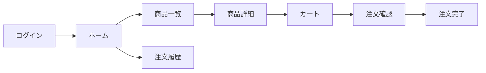

# 1. 概要

## 1.1 目的

* 設計ドキュメントに基づき、手戻りのない実装ラインを構築する

## 1.2 成果物（最終ゴール）

* リリース対象: <Webアプリケーション>, <APIサーバー>

  * 例: Web（Next.js）, API（Go/Node.js）

## 1.3 スコープ

### In Scope

* <機能を列挙>

  * 例: **ユーザー・認証**: 登録(F-01)、ログイン(F-02)、マイページ(F-03)
  * 例: **商品**: 商品一覧、商品詳細、在庫管理
  * 例: **注文**: 注文作成、注文履歴
  * 例: **管理機能**: 商品管理ダッシュボード

### Out of Scope（今回やらない）

* 例: 決済ゲートウェイ連携（モックで対応）
* 例: 複雑なプロモーション/クーポン機能
* 例: 高度な分析・レポーティング基盤

## 1.4 前提・制約

* 技術スタック:

  * Frontend: Next.js / React
  * Backend: Go (or Node.js)
  * Database: PostgreSQL
  * Infra: Docker / AWS/GCP
* アーキテクチャ: レイヤードアーキテクチャ (Presentation, Application, Domain, Infrastructure)

## 1.5 参照ドキュメント

* 例: `templates/design/01_basic_design.md`（機能一覧 / 画面遷移）
* 例: `templates/design/screen/<feature-name>_screen_design.md`（画面仕様）
* 例: `templates/design/db/03_db_design.md`（ER図 / テーブル定義）
* 例: `templates/design/02_api_design.md`（API IF / OpenAPI）
* 例: `templates/design/04_architecture_design.md`（アーキテクチャ / ディレクトリ構成）
* 例: `templates/design/05_non_functional_requirements.md`（非機能要件）
* 例: `templates/design/09_roles_permissions.md`（権限 / ロール）

## 1.6 本章で参照した設計ドキュメント

* `docs/<document-name>.md`（要確認）

---

# 2. 依存関係の整理（最重要）

## 2.1 機能・画面一覧（カタログ）

> ここで「何があるか」と「依存」を固定し、実装順と並行作業を成立させる。

### 機能カタログ（例）

* [F-01] 認証
* [F-02] ユーザー設定
* [F-03] 商品一覧
* [F-04] 商品詳細
* [F-05] 注文作成
* [F-06] 注文履歴
* [F-07] 管理：商品管理
* [F-08] 管理：注文管理

### 画面カタログ（例）

* [S-01] ログイン
* [S-02] ホーム
* [S-03] 商品一覧
* [S-04] 商品詳細
* [S-05] カート
* [S-06] 注文確認
* [S-07] 注文完了
* [S-08] 注文履歴

## 2.2 依存関係マトリクス（ざっくりでOK）

| ID   | 種別 | 名称   | 依存（前提）          | 後続（これを待つ）    | 備考      |
| ---- | -- | ---- | --------------- | ------------ | ------- |
| F-01 | 機能 | 認証   | -               | F-02, S-02以降 | 認可も含むか？ |
| S-03 | 画面 | 商品一覧 | F-03(API)       | S-04         | -       |
| S-04 | 画面 | 商品詳細 | F-04(API), S-03 | S-05         | -       |

## 2.3 画面遷移（Mermaid）

## 2.4 本章で参照した設計ドキュメント

* `docs/<document-name>.md`（要確認）

---

# 3. モック方針（遷移先がスコープ外/未実装の場合）

## 3.1 ルール

* 遷移先の画面が タスクのスコープ外 かつ 未実装 の場合、該当タスク内では モック画面 を用意してつなぐ
* モックは「遷移の成立」「UI検証」「結合ポイント固定」が目的（本実装の代替ではない）

## 3.2 モックの定義（例）

* モック画面ID: S-MOCK-xx
* 置き換え条件:
* API未完成 → モックデータ/スタブ
* 画面未完成 → モック画面（ダミーUI + 戻る/次へだけ）
* モック除去の責務:
* 後続タスクに「モック除去」チェックを含める

## 3.3 本章で参照した設計ドキュメント

* `docs/<document-name>.md`（要確認）

---

# 4. フェーズ別 実装計画

各フェーズは「並行可能な束」で切る。依存のあるものは先に“固定物（IF/モック/共通部品）”を作る。

## Phase 1: プロジェクトセットアップ

| 優先 | タスクID | 対象 | 依存 | 内容（ざっくり） | モック要否 | 担当 | PR/Issue |
| :--- | :--- | :--- | :--- | :--- | :--- | :--- | :--- |
| P0 | T-001 | Repo | - | リポジトリ作成/権限設定 | なし | | |
| P0 | T-002 | Env | T-001 | 環境構築（local/dev/stg/prodの雛形） | なし | | |
| P1 | T-003 | CI | T-001 | CI（lint/test/build）導入 | なし | | |
| P1 | T-004 | Base | T-001 | コーディング規約/フォーマッタ導入 | なし | | |
| P2 | T-005 | Obs | - | 監視/ログ/エラー通知の最小導入（可能なら） | なし | | |

## Phase 2: データベーススキーマ完成

このフェーズは **1テーブル = 1タスク** を原則とする。テーブルごとに、設計確認、DDL定義、制約、インデックス、初期データ要否を整理できる粒度で分割する。

| 優先 | タスクID | 対象 | 依存 | 内容（ざっくり） | モック要否 | 担当 | PR/Issue |
| :--- | :--- | :--- | :--- | :--- | :--- | :--- | :--- |
| P0 | T-007 | users | T-002 | `users` テーブル定義の確定（主キー/一意制約/監査項目を含む） | なし | | |
| P0 | T-008 | products | T-002 | `products` テーブル定義の確定（主キー/制約/インデックスを含む） | なし | | |
| P0 | T-009 | orders | T-007, T-008 | `orders` テーブル定義の確定（外部キー/制約/インデックスを含む） | なし | | |
| P1 | T-010 | order_items | T-009 | `order_items` テーブル定義の確定（外部キー/制約を含む） | なし | | |

テーブル数が増える場合は、この表をテーブル数に応じて増やす。共通方針だけの横断タスクは原則作らず、各テーブルのタスク内に含める。

## Phase 3: 機能実装（依存順で進める）

**ここがメイン**。依存の“上流”から下流へ。未実装の遷移先はモックでつなぐ。

実装順（例の考え方）

1. 一覧 → 詳細 → 作成/更新 → 完了/履歴（ユーザー導線順）
2. 依存が多い「認証」「共通UI」「データ取得基盤」は先に
3. 管理画面は後半に回す（ユーザー機能が固まってから）

ざっくりタスク（記入欄）

| 優先 | タスクID | 対象   | 依存   | 内容（ざっくり）             | モック要否    | 担当 | PR/Issue |
| -- | ----- | ---- | ---- | -------------------- | -------- | -- | -------- |
| P0 | T-018  | F-01 | -    | 認証（ログイン/ログアウト/ガード）   | なし       |    |          |
| P0 | T-019  | S-03 | T-?? | 商品一覧画面（API接続 or モック） | API未完なら要 |    |          |
| P1 | T-020  | S-04 | T-019 | 商品詳細画面（遷移/表示）        | 遷移先未完なら要 |    |          |

※「モック要否」には「未実装の遷移先」「未完成API」どちらが理由かも書く

## Phase 4: 結合 & 仕様調整

| 優先 | タスクID | 対象 | 依存 | 内容（ざっくり） | モック要否 | 担当 | PR/Issue |
| :--- | :--- | :--- | :--- | :--- | :--- | :--- | :--- |
| P0 | T-021 | 全体 | Phase 5 | 主要導線の結合（ログイン→主要機能→完了） | なし | | |
| P0 | T-022 | 全体 | T-021 | モック除去（S-MOCKの置換） | なし | | |
| P1 | T-023 | 全体 | T-021 | 権限/境界値/エラー系の統合 | なし | | |
| P2 | T-024 | Perf | - | パフォーマンス/ページング/キャッシュ（必要なら） | なし | | |
| P1 | T-025 | Spec | - | 仕様の微修正（変更履歴を残す） | なし | | |

## 4.1 本章で参照した設計ドキュメント

* `docs/<document-name>.md`（要確認）

---

# 5. 変更履歴

| 日付         | 変更者 | 変更内容 | 理由 |
| ---------- | --- | ---- | -- |
| YYYY-MM-DD |     | 初版   | -  |

## 5.1 本章で参照した設計ドキュメント

* `docs/<document-name>.md`（要確認）

---
