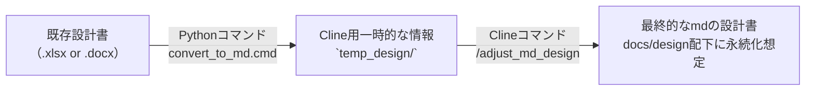
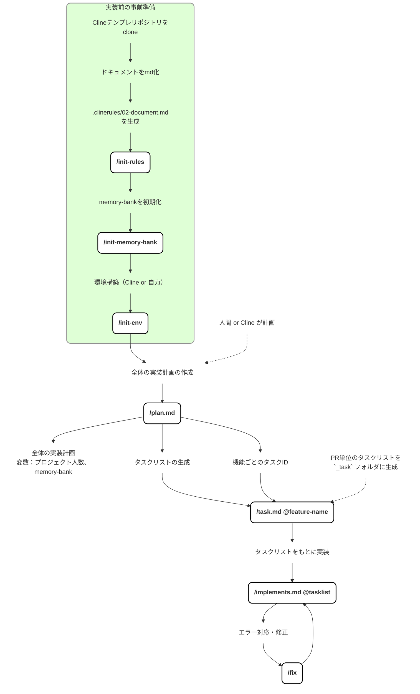

```mermaid
flowchart LR
    A[既存設計書<br>（.xlsx or .docx）] -->|Pythonコマンド<br>convert_to_md.cmd| B[Cline用一時的な情報<br>`temp_design/`]
    B -->|Clineコマンド<br>/adjust_md_design| C[最終的なmdの設計書<br>docs/design配下に永続化想定]

```

```mermaid
graph TD
    %% スタイル定義
    classDef default fill:#fff,stroke:#333,stroke-width:1px;
    classDef command fill:#fff,stroke:#000,stroke-width:2px,rx:10,ry:10,font-weight:bold;
    classDef container fill:#dfffd6,stroke:#999,stroke-width:2px,rx:10,ry:10,color:#333;
    classDef plain fill:none,stroke:none,color:#333;

    %% --- 実装前の事前準備エリア ---
    subgraph Prep [実装前の事前準備]
        direction TB
        Step1[Clineテンプレリポジトリをclone]:::plain --> Step2[ドキュメントをmd化]:::plain
        Step2 --> Step3[.clinerules/02-document.mdを生成]:::plain
        Step3 --> Cmd1(/init-rules):::command
        Cmd1 --> Step4[memory-bankを初期化]:::plain
        Step4 --> Cmd2(/init-memory-bank):::command
        Cmd2 --> Step5["環境構築（Cline or 自力）"]:::plain
        Step5 --> Cmd3(/init-env):::command
    end

    %% --- 実装計画フェーズ ---
    Cmd3 --> Step6[全体の実装計画の作成]:::plain
    Step6 --> Cmd4(/plan.md):::command

    %% plan.md からの分岐・注釈
    NotePlan[人間 or Cline が計画]:::plain -.-> Step6
    Cmd4 --> OutPlan["全体の実装計画<br>変数：プロジェクト人数、memory-bank"]:::plain
    Cmd4 --> OutID[機能ごとのタスクID]:::plain

    %% --- タスクリスト生成 ---
    Cmd4 --> Step7[タスクリストの生成]:::plain
    Step7 --> Cmd5("/task.md @feature-name"):::command
    
    %% 矢印の合流
    OutID --> Cmd5
    NoteTask["PR単位のタスクリストを<br>`_task` フォルダに生成"]:::plain -.-> Cmd5

    %% --- 実装フェーズ ---
    Cmd5 --> Step8[タスクリストをもとに実装]:::plain
    Step8 --> Cmd6("/implements.md @tasklist"):::command

    %% --- 修正ループ ---
    Cmd6 --> Step9[エラー対応・修正]:::plain
    Step9 --> Cmd7(/fix):::command
    
    %% ループバック
    Cmd7 --> Cmd6

    %% サブグラフのスタイル適用
    class Prep container
```
