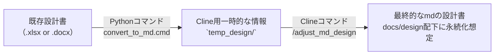

```mermaid
graph TD
    %% スタイル定義
    classDef default fill:#fff,stroke:#333,stroke-width:1px;
    classDef greenGroup fill:#e0f7e0,stroke:#333,stroke-width:1px;
    classDef note fill:none,stroke:none;

    %% 事前準備サブグラフ
    subgraph Prep [実装前の事前準備]
        direction TB
        Clone("Clineテンプレリポジトリをclone")
        MD("ドキュメントをmd化")
        InitMB("memory-bankを初期化<br>/init-memory-bank")
        Env("環境構築<br>Cline or 自力<br>/init-env")

        Clone --> MD
        MD --> InitMB
        InitMB --> Env
    end
    class Prep greenGroup

    %% ドキュメント変換フロー（右側）
    Existing["既存設計書"]
    Temp["Cline用一時的な情報<br>`temp_design/`"]
    Final["最終的なmdの設計書<br>docs/design配下に永続化想定"]

    MD -.-> Existing
    Existing -- "Pythonコマンド<br>convert_to_md.cmd" --> Temp
    Temp -- "Clineコマンド<br>/adjust_md_design" --> Final

    %% メインフロー続き
    Plan("全体の実装計画の作成<br>/plan.md")
    Task("タスクリストの生成<br>/task.md Task-ID")
    Impl("タスクリストをもとに実装<br>/implements.md @tasklist")
    Fix("エラー対応・修正<br>/fix")

    Env --> Plan
    Plan --> Task
    Task --> Impl
    Impl --> Fix
    Fix -- "繰り返す" --> Impl

    %% 注釈（右側）
    NoteMB["Memory-bankにはどこにどんな設計書が<br>あるのかを書いた省略版設計書を作成"]
    InitMB --- NoteMB

    NotePlan["人間 or Cline が計画<br>全体の実装計画<br>変数：プロジェクト人数、memory-bank"]
    Plan --- NotePlan

    NoteTask["PR単位のタスクリストを<br>`_task` フォルダに生成"]
    Task --- NoteTask

    %% 注釈のスタイル適用
    class NoteMB,NotePlan,NoteTask note```


````
あなたは経験豊富なシステムアーキテクト兼テクニカルライターです。
以下の「現行設計書（抜粋）」を、AI検証環境の制約に合わせて改訂してください。

# 背景
- AI検証のために実プロジェクトの設計書を使用している。
- 設計書には AWS や SAML 認証など「外部サービス/外部アカウントが必要な連携」が記載されている。
- しかし検証では外部連携が不可（外部アカウントがない、ネットワーク制約、審査・契約の都合等）である。
- そのため、外部連携を「設計から外す／差し替える」必要がある。

# 必須制約（絶対に守る）
- AWS / SAML / 外部IdP / 外部API / SaaS など、外部アカウントが必要な連携は利用しない前提に変更する。
- ただし、将来の本番実装で外部連携へ戻せるように、設計は差し替え可能（疎結合）にする。
- セキュリティ要件や監査観点は「検証では簡略化するが、本番との差分とリスク」を明記する。
- 秘密情報（キー、トークン、URL、企業名、個人情報）は出力しない。必要な場合は必ずマスクして記載する。

# 目的（この改訂で達成したいこと）
- 外部連携部分を検証可能な代替案に置換し、設計書として筋の通った形にする。
- 「何を外したか」「何に置き換えたか」「影響範囲」「残課題」を追跡できるようにする。

# 改訂ルール
1) 設計書内で外部連携に該当する箇所をすべて列挙（AWS, SAML, OAuth, 外部API, メール送信, 監視, ストレージ等）
2) 各項目について以下を必ず提示する：
   - 現行の設計（何をしているか）
   - 検証で不可な理由（外部アカウント/ネットワーク/契約 等）
   - 代替案（検証で実現できる方式）
   - 代替案のメリット/デメリット
   - 本番との差分・リスク・注意点
   - 設計への反映内容（どの章・どの図・どのAPI仕様にどう反映するか）
3) 代替案は、可能なら複数案（推奨案 + 次善案）を提示し、推奨理由を添える。
4) 代替案は “ダミー実装/スタブ/モック/エミュレーター/ローカル実装/インターフェース抽象化/Feature Flag” を積極的に使う。
5) 文章は「設計書にそのまま貼れる」体裁で書く。

# 出力形式（この順番で）
A. 変更サマリ（外した外部連携一覧と置換先の対応表）
B. 影響範囲（アーキ図、シーケンス図、API、DB、運用、テスト、セキュリティ）
C. 改訂した設計書本文（差し替えた章を、章見出し付きで記載）
D. 本番復帰のためのTODO（外部連携を戻す際の作業、設定、検証観点）
E. 未確定事項 / 追加で必要な情報（質問があれば最後にまとめる）

# 現行設計書（ここに貼る）
<<<
（ここに設計書の該当章や全文を貼る）
>>>

# 検証環境の前提（分かる範囲で書く：無ければ仮定してよい）
- 例：インターネットアクセス不可/可、Docker可、ローカルDB可、SMTP不可、など
<<<
（ここに条件を書く。空なら“一般的な検証環境”として仮定して進める）
>>>
````


# 以下メモ

# AI駆動開発実装ガイド

AI駆動開発をPJに導入するにあたって、下記の順で始めることができます。
詳細は各パートで説明します。

1. 環境構築で、PJでAIエージェントを利用する環境を整えます。
1. 設計で、AIエージェントがエンジニアとしてPJに参画するための準備を行います。
1. 実装で、AIエージェントに開発作業を実施させます。

<br/>

1. 環境構築
    1. Clineの実行環境構築
    1. チーム開発用の環境構築
1. 設計
    1. 全体設計
    1. 個別設計
1. 実装
    1. .xlsx, .docs形式の設計書を.mdファイルに変換する
    1. Cline の Memory Bank の設定
    1. Clineでコード生成
    1. 品質チェック・テスト実行

## 環境構築

### Clineの実行環境構築

各開発者で VSCode & Cline 拡張機能をセットアップします。

### チーム開発用の環境構築

チーム開発用に以下を用意します。
プロジェクトに特に制約がなければ、GitHubを使用します。

- ソースコードレポジトリ
- CI/CD環境

ソースコードリポジトリには下記のテンプレートを設置してください

※このリポジトリからZipダウンロードする。

**リポジトリ構成**
```
C:.
├─.clinerules        
│  └─workflows       # Cline用のコマンドmdを設定しているフォルダ
├─docs               # Clineの使用手順を示したドキュメント群
├─memory-bank        # Cline用のメモリーバンクテンプレ
├─scripts            # マークダウンへの変換用スクリプトが入っている
│  └─設計書
├─templates          # 変換後のマークダウン用の設計書テンプレ
│  └─design
│      ├─batches
│      ├─db_tables
│      └─screen
```

## 設計

設計はこれまで通り、.xlsxファイル、.docxファイル形式で作成します。
作成したものを Microsoft 365 Copilot を使用して.mdファイルに変換します。

### mdへの変換手順
1. scriptsフォルダ内に記載されたものに従って変換（[変換手順ドキュメント](../scripts/README.md)
2. 変換後、 clineへ `/adjust_md_design.md` コマンドを使用してテンプレの形の設計書に成形


## 実装

### Step0. Cline の Memory Bank の設定
Cline には Memory Bank という機能があり、Cline との会話開始時に自動で読み込むファイルを指定できます。

これはClineのための記憶の保管庫であり、人間による深いレビューは現段階では不要です。

#### 手順

1. リポジトリの構成があっているか確認してください。（環境構築の部分参照）
2. Clineに `/init-memory-bank` と入力し、メモリーバンクの初期化をします。（`/ini`くらいまで入力したら補完で出てきます。）
3. Clineが自動でMemory-bank内のテンプレートを更新してくれます。

### Step1. /plan を使用して実装計画を作成し、共通基盤を実装する
cline に `/plan` コマンドを送信し、実装計画を作成してもらいます。（`docs/` フォルダに生成されます。）

その後、実装計画の "フェーズ別 実装計画" の部分におけるphase0 ~ 3 (場合によっては4も)の共通部分の実装を最初に行います。

手順はStep2で解説している手順と同様です。

### Step2. Clineを使ってタスクごとにコーディング

流れとしては、 **`Clineがタスクリストを生成 → ユーザーが確認＆承認 → Clineがタスクリストに沿って実装を開始`** 

#### 手順
1. `/tasks.md タスクID` と Cline へ送信（例 `/tasks.md T-001` タスクIDは実装計画内に記載されています。）
2. Cline が `_tasks/` 配下にタスクリストを作成する
3. ここで生成されるタスクリストはClineが忘れないためのものなので明らかにおかしくない限り修正する必要はありません。
4. `/implement.md @\_tasks/tasklist` を送信。(`@`でタスクリストを添付して送信)
5. Clineが実装を開始。
6. 完了前にClineが止まってしまった場合は「続きのタスクを実行して」など同じ会話の中でプロンプトを送信。
7. 機能の実装が終わるまで基本的には一つの会話の中でやり取りを行う。
8. 一つのタスクの実装が完了したら`update memory-bank` とプロンプトを入力し会話を終了する
9. 実装計画にあるタスクに対してこの手順を繰り返す。Clineとの会話はタスクごとに新規作成する。

エラーや思った挙動と異なる場合は下記の修正ガイドを参考に修正を依頼する

- [修正ガイド](./fix_guid.md)

### Step3. 品質チェック・テスト実行

TODO:

## Tips

### 画面遷移図の取り扱い
- エクセルに図で書いているなら Copilot を使って mermaid記法でdocsに設置する
- memory-bankの中に反映させることができる

#### 手順
1. エクセルを開く
2. 画面面遷移図をキャプチャ
3. Copilot に画像を添付して下記のプロンプトを追記
4. エラーが出た場合は `正しくレンダリングできていないので修正して` とプロンプトを打つ
5. 完成したコードを `docs/画面遷移図.md` として保存

**プロンプト**
```
画像をMermaid記法で出力してほしい
```
