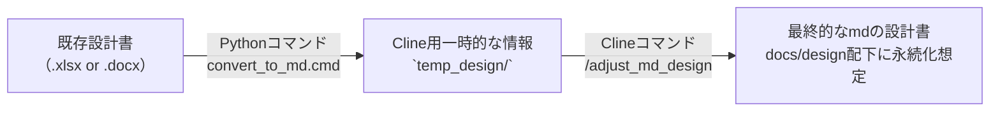
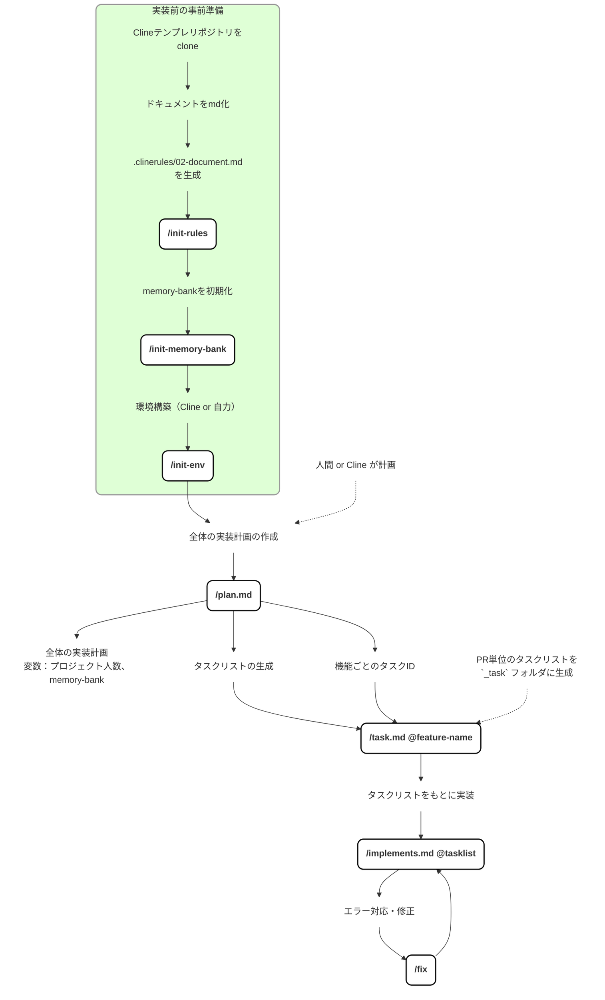

````
あなたは経験豊富なシステムアーキテクト兼テクニカルライターです。
以下の「現行設計書（抜粋）」を、AI検証環境の制約に合わせて改訂してください。

# 背景
- AI検証のために実プロジェクトの設計書を使用している。
- 設計書には AWS や SAML 認証など「外部サービス/外部アカウントが必要な連携」が記載されている。
- しかし検証では外部連携が不可（外部アカウントがない、ネットワーク制約、審査・契約の都合等）である。
- そのため、外部連携を「設計から外す／差し替える」必要がある。

# 必須制約（絶対に守る）
- AWS / SAML / 外部IdP / 外部API / SaaS など、外部アカウントが必要な連携は利用しない前提に変更する。
- ただし、将来の本番実装で外部連携へ戻せるように、設計は差し替え可能（疎結合）にする。
- セキュリティ要件や監査観点は「検証では簡略化するが、本番との差分とリスク」を明記する。
- 秘密情報（キー、トークン、URL、企業名、個人情報）は出力しない。必要な場合は必ずマスクして記載する。

# 目的（この改訂で達成したいこと）
- 外部連携部分を検証可能な代替案に置換し、設計書として筋の通った形にする。
- 「何を外したか」「何に置き換えたか」「影響範囲」「残課題」を追跡できるようにする。

# 改訂ルール
1) 設計書内で外部連携に該当する箇所をすべて列挙（AWS, SAML, OAuth, 外部API, メール送信, 監視, ストレージ等）
2) 各項目について以下を必ず提示する：
   - 現行の設計（何をしているか）
   - 検証で不可な理由（外部アカウント/ネットワーク/契約 等）
   - 代替案（検証で実現できる方式）
   - 代替案のメリット/デメリット
   - 本番との差分・リスク・注意点
   - 設計への反映内容（どの章・どの図・どのAPI仕様にどう反映するか）
3) 代替案は、可能なら複数案（推奨案 + 次善案）を提示し、推奨理由を添える。
4) 代替案は “ダミー実装/スタブ/モック/エミュレーター/ローカル実装/インターフェース抽象化/Feature Flag” を積極的に使う。
5) 文章は「設計書にそのまま貼れる」体裁で書く。

# 出力形式（この順番で）
A. 変更サマリ（外した外部連携一覧と置換先の対応表）
B. 影響範囲（アーキ図、シーケンス図、API、DB、運用、テスト、セキュリティ）
C. 改訂した設計書本文（差し替えた章を、章見出し付きで記載）
D. 本番復帰のためのTODO（外部連携を戻す際の作業、設定、検証観点）
E. 未確定事項 / 追加で必要な情報（質問があれば最後にまとめる）

# 現行設計書（ここに貼る）
<<<
（ここに設計書の該当章や全文を貼る）
>>>

# 検証環境の前提（分かる範囲で書く：無ければ仮定してよい）
- 例：インターネットアクセス不可/可、Docker可、ローカルDB可、SMTP不可、など
<<<
（ここに条件を書く。空なら“一般的な検証環境”として仮定して進める）
>>>
````
