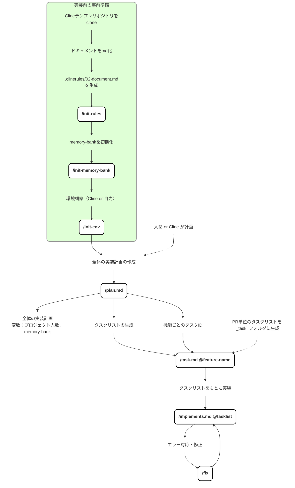

# 以下メモ

# AI駆動開発実装ガイド

AI駆動開発をPJに導入するにあたって、下記の順で始めることができます。
詳細は各パートで説明します。

1. 環境構築で、PJでAIエージェントを利用する環境を整えます。
1. 設計で、AIエージェントがエンジニアとしてPJに参画するための準備を行います。
1. 実装で、AIエージェントに開発作業を実施させます。

<br/>

1. 環境構築
    1. Clineの実行環境構築
    1. チーム開発用の環境構築
1. 設計
    1. 全体設計
    1. 個別設計
1. 実装
    1. .xlsx, .docs形式の設計書を.mdファイルに変換する
    1. Cline の Memory Bank の設定
    1. Clineでコード生成
    1. 品質チェック・テスト実行

## 環境構築

### Clineの実行環境構築

各開発者で VSCode & Cline 拡張機能をセットアップします。

### チーム開発用の環境構築

チーム開発用に以下を用意します。
プロジェクトに特に制約がなければ、GitHubを使用します。

- ソースコードレポジトリ
- CI/CD環境

ソースコードリポジトリには下記のテンプレートを設置してください

※このリポジトリからZipダウンロードする。

**リポジトリ構成**
```
C:.
├─.clinerules        
│  └─workflows       # Cline用のコマンドmdを設定しているフォルダ
├─docs               # Clineの使用手順を示したドキュメント群
├─memory-bank        # Cline用のメモリーバンクテンプレ
├─scripts            # マークダウンへの変換用スクリプトが入っている
│  └─設計書
├─templates          # 変換後のマークダウン用の設計書テンプレ
│  └─design
│      ├─batches
│      ├─db_tables
│      └─screen
```

## 設計

設計はこれまで通り、.xlsxファイル、.docxファイル形式で作成します。
作成したものを Microsoft 365 Copilot を使用して.mdファイルに変換します。

### mdへの変換手順
1. scriptsフォルダ内に記載されたものに従って変換（[変換手順ドキュメント](../scripts/README.md)
2. 変換後、 clineへ `/adjust_md_design.md` コマンドを使用してテンプレの形の設計書に成形


## 実装

### Step1. Cline の Memory Bank の設定
Cline には Memory Bank という機能があり、Cline との会話開始時に自動で読み込むファイルを指定できます。

これはClineのための記憶の保管庫であり、人間による深いレビューは現段階では不要です。

#### 手順

1. リポジトリの構成があっているか確認してください。（環境構築の部分参照）
2. Clineに `/init-memory-bank` と入力し、メモリーバンクの初期化をします。（`/ini`くらいまで入力したら補完で出てきます。）
3. Clineが自動でMemory-bank内のテンプレートを更新してくれます。

### Step1. /plan を使用して実装計画を作成し、共通基盤を実装する
cline に `/plan` コマンドを送信し、実装計画を作成してもらいます。（`docs/` フォルダに生成されます。）

その後、実装計画の "フェーズ別 実装計画" の部分におけるphase0 ~ 3 (場合によっては4も)の共通部分の実装を最初に行います。

### Step2. Clineを使ってタスクごとにコーディング

流れとしては、 **`Clineがタスクリストを生成 → ユーザーが確認＆承認 → Clineがタスクリストに沿って実装を開始`** 

#### 手順
1. `/tasks.md タスクID` と Cline へ送信（例 `/tasks.md T-001` タスクIDは実装計画内に記載されています。）
2. Cline が `_tasks/` 配下にタスクリストを作成する
3. ここで生成されるタスクリストはClineが忘れないためのものなので明らかにおかしくない限り修正する必要はありません。
4. `/implement.md @\_tasks/tasklist` を送信。(`@`でタスクリストを添付して送信)
5. Clineが実装を開始。
6. 完了前にClineが止まってしまった場合は「続きのタスクを実行して」など同じ会話の中でプロンプトを送信。
7. 機能の実装が終わるまで基本的には一つの会話の中でやり取りを行う。
8. 一つのタスクの実装が完了したら`update memory-bank` とプロンプトを入力し会話を終了する
9. 実装計画にあるタスクに対してこの手順を繰り返す。Clineとの会話はタスクごとに新規作成する。

エラーや思った挙動と異なる場合は下記の修正ガイドを参考に修正を依頼する

- [修正ガイド](./fix_guid.md)

### Step3. 品質チェック・テスト実行

TODO:

## Tips

### 画面遷移図の取り扱い
- エクセルに図で書いているなら Copilot を使って mermaid記法でdocsに設置する
- memory-bankの中に反映させることができる

#### 手順
1. エクセルを開く
2. 画面面遷移図をキャプチャ
3. Copilot に画像を添付して下記のプロンプトを追記
4. エラーが出た場合は `正しくレンダリングできていないので修正して` とプロンプトを打つ
5. 完成したコードを `docs/画面遷移図.md` として保存

**プロンプト**
```
画像をMermaid記法で出力してほしい
```