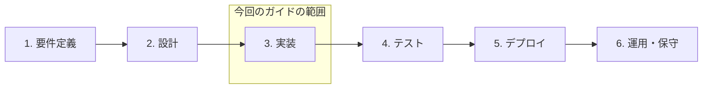
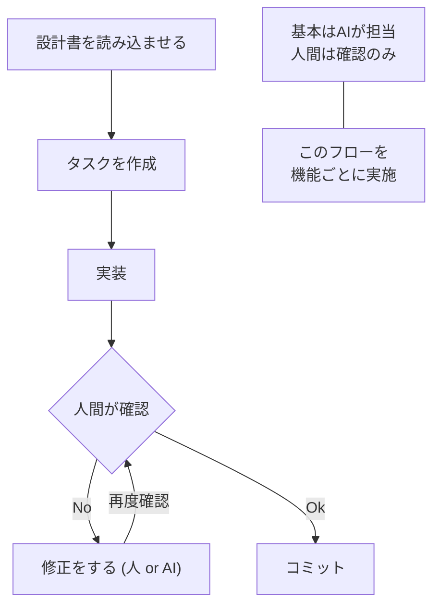

このリポジトリは、Cline を使用した開発のガイドラインを提供します。

具体的な手順は以下のリンクを参照してください:

* [新規開発ガイドライン（1月末公開済み）](docs/development-guide.md)
* [追加機能開発ガイドライン（2月末更新済み）](docs/追加機能開発手順.md)
* [開発ワークフロー図](docs/開発全体のワークフロー図.md)

## 概要

今回のガイドでは**新規開発**全体における実装部分にのみ焦点を当て、AIを十分に活用する方法について紹介しています。
設計やテストの部分は今回のガイドの対象外なので従来通りの手順で行います。

```mermaid
flowchart LR
    
    A["1. 要件定義"]
    B["2. 設計"]
    D["4. テスト"]
    E["5. デプロイ"]
    F["6. 運用・保守"]

    subgraph g1["今回のガイドの範囲"]
        C["3. 実装"]
    end
    A --> B
    B --> C
    C --> D
    D --> E
    E --> F

```

## 実装ワークフローイメージ

```mermaid
flowchart TB
    A["設計書を読み込ませる"]
    B["タスクを作成"]
    C["実装"]
    D{"人間が確認"}
    E["修正をする (人 or AI)"]
    F["コミット"]
    G["基本はAIが担当<br>人間は確認のみ"]
    H["このフローを<br>機能ごとに実施"]
    A --> B
    B --> C
    C --> D
    D --"No"--> E
    D --"Ok"--> F
    E --"再度確認"--> D
    G --- H


```

## 現在のAIの実力

**基本的にAIが完璧にコーディングしてくれることはありません。**

簡単な、CRUD操作のみのアプリケーションであれば作成は可能ですが複雑なシステムになればなるほど人の手による修正が必要になってきます。

しかし、簡単な部分はAIにAIができなかった部分のみを人間が修正してあげることで実装全体の効率を高めることが期待できます。

## 使用する際の前提条件

1. 既存の設計書があり
1. ソースコードがない状態（サンプルがある場合が多いから全くない状態ではない）
1. スクラッチ開発経験あり
1. AIを使わなくても実装できる人が使用する（誤解を招かない）
1. AIをコーディング効率を高めるためのものとして使う
1. 生成されたコードを説明できるものに収める（まったく何をしているか説明できないコードは使用を控える）
1. 生成されたコードは60点のたたき台である
1. 
1. 
1. 