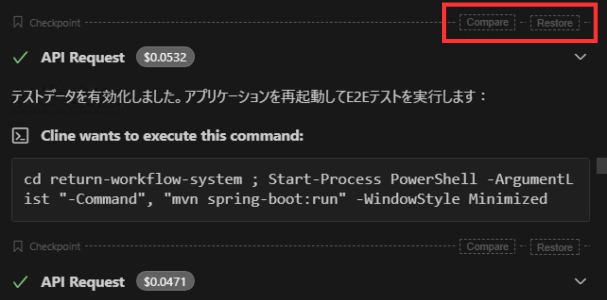

# 400 input error となり、Clineが止まった際の対処法

## 原因

- **モデルの最大コンテキスト長（トークン数）を超過している**
  - 典型例：`This model's maximum context length is XXXX tokens. However, you requested YYYY tokens` や `maximum prompt length is ... but the request contains ... tokens` のような 400 が出ます。
  - 巨大なログファイルを参照した
  - ツール実行結果（特に長いターミナル出力、npm testなど）を抱えた
  - 会話が長くなった、などで「messages（入力）」側が肥大化して起きがちです。

## 対処法

1. **Restore で“直前の会話”まで戻す**

    

   - 止まった直前のステップ横の **「Restore」** を押し、状況に応じて選びます。(基本的には `Restore Task and Workspace` を選択)  
     - **Restore Task Only**：コードはそのまま、会話（タスクコンテキスト）だけ戻す  
     - **Restore Task and Workspace**：会話とコードをその時点へ戻す  
     - **Restore Workspace Only**：コードだけ戻す

2. **実行したコマンドの出力を制限するように指示をして再実行**
   - `npm test` や `mvn test` などのコマンドは大量のログが出るので下記のように指示を追加して再実行する。
   - または、具体的にログを短くするコマンドを指示。
   ````bash
   **ターミナルでコマンドを実行する際は下記のテンプレに従って、ファイルにログを保存し、末尾200行のみを出力すること**
    ```powershell
    Set-Location <project-path>
    $log = "<logfile>.log"

    <command> *>&1 |
    Out-File -FilePath $log -Encoding utf8

    Get-Content $log -Tail 200
    ```
   ````