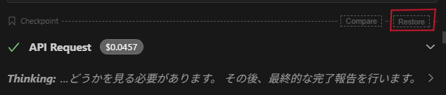

### CheckpointsのRestore（コードを過去の状態に戻す）

これは、Clineが作業を進める中で「やっぱり前の状態に戻したい」「この変更は取り消したい」と思った時に、**タイムマシンのように特定の時点までファイルの状態を戻す機能**です。

#### どのような時に使うか？

* AIが修正を加えた結果、エラーが増えてしまった時。
* 指示の方向性が間違っていたので、指示を出す前の状態からやり直したい時。
* 手動で修正するより、一度リセットして再度指示出しをした方が早い時。

#### Restoreの手順

1. **チャット履歴を遡る**
Clineのサイドバーにあるチャット画面で、戻りたい時点（過去のメッセージ）までスクロールして遡ります。
2. **Restoreボタンを探す**
各メッセージ（特にファイル操作が行われたタイミング）の近くに、**「Restore」**ボタン、または「Checkpoints」に関連するアイコン（時計や巻き戻しマークのようなアイコンの場合もあります）が表示されます。
* ※バージョンによっては、メッセージにマウスオーバーすると表示される場合があります。

3. **クリックして実行**
ボタンをクリックすると、**「その時点以降に行われた全てのファイル変更」が破棄**され、ワークスペースがその時点の状態に書き戻されます。同時に、チャットの履歴もその時点以降のものは削除され、そこから会話を再開できます。

> **注意点:** Restoreを実行すると、その時点より「未来」の変更や会話ログは基本的に消えてしまいます。必要なコードがある場合は、事前に別ファイルに退避させておくことをお勧めします。