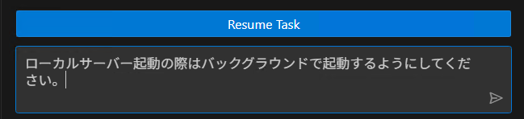

# Clineがターミナルからの応答を待ち続けて止まってしまう

## 原因は主に3つ
- A: Clineがコマンドを実行した際にターミナルが入力を求め、Clineはそれを認識できていない
- B: ローカルサーバー立ち上げコマンドなど、実行したのちに終了せずにログを出すコマンド
- C: ただ単純に時間がかかっている場合（通常は短いコマンドでも、Clineに実行させると時間がかかる場合がある）

## 対処法
1. 原因の切り分けを行う
    - Cline が実行したコマンドを別ターミナルで開いて実行する
    - 途中で止まって操作を求められる: →A
    - ローカルサーバーの起動などコマンドが終了しない: →B
    - 正常に終了した場合: →C

1. Aの場合
    - Clineが実行したターミナル内でユーザーが入力をしてあげる
1. Bの場合
    - Restore 機能を用いてコマンド実行の前まで戻り、下記の指示をしてタスクを再開する
    - Resumeボタンではなくメッセージボックスに入力して、送信する

    

    ```
    ローカルサーバー起動の際はバックグラウンドで起動するようにしてください
    ```
1. Cの場合
    - 時間がかかりますが待っていれば正常に動作します。
