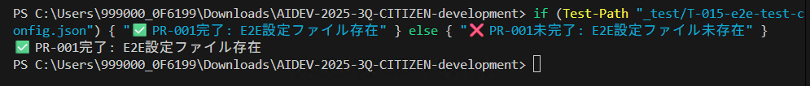
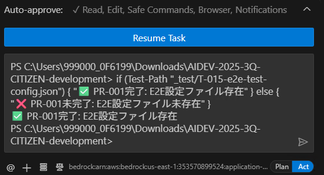

# Clineがターミナルからの応答を待ち続けて止まってしまう

## 原因は主に3つ
- A: Clineがコマンドを実行した際にターミナルが入力を求め、Clineはそれを認識できていない
- B: ローカルサーバー立ち上げコマンドなど、実行したのちに終了せずにログを出すコマンド
- C: コマンドは正常に終了しているのにClineが認識できていない

## 対処法
1. 原因の切り分けを行う
    - 方法：Cline が実行したコマンドを別ターミナルで開いて実行する
    - 途中で止まって操作を求められる: →A
    - ローカルサーバーの起動などコマンドが終了しない: →B
    - 正常に終了した場合: →C

1. Aの場合
    - Clineが実行したターミナル内でユーザーが入力をしてあげる

1. Bの場合
    - Restore 機能を用いてコマンド実行の前まで戻り、下記の指示をしてタスクを再開する
    - Resumeボタンではなくメッセージボックスに入力して、送信する

    

    ```
    ローカルサーバー起動の際はバックグラウンドで起動するようにしてください
    ```

1. Cの場合

    

    - 上記の画像のように正常にコマンドは終了するけど、Clineが認識できていない状態
    
    1. `new task ボタン` をクリックしてトップに行き、もう一度この会話を開きなおす
        `+` マークで新しい会話を開く→履歴から同じ会話を開きなおす
    2. 実行した結果をプロンプトとして送信する。

    
    