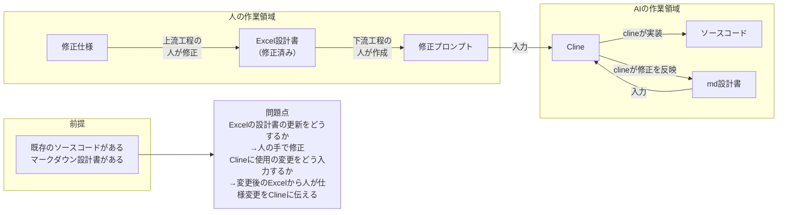

```mermaid
flowchart LR
 subgraph human["人の作業領域"]
        B["Excel設計書<br>（修正済み）"]
        A["修正仕様"]
        C["修正プロンプト"]
  end
 subgraph text["前提"]
        G["既存のソースコードがある<br>マークダウン設計書がある<br>"]
  end
    A -- 上流工程の</br>人が修正 --> B
    B -- 下流工程の<br>人が作成 --> C
    subgraph ai["AIの作業領域"]

    C -- 入力 --> D["Cline"]
    D -- clineが実装 --> E["ソースコード"]
    F["md設計書"] -- 入力 --> D
    D -- clineが修正を反映 --> F
    end
    G --> n1["問題点<br>Excelの設計書の更新をどうするか<br>→人の手で修正<br>Clineに使用の変更をどう入力するか<br>→変更後のExcelから人が仕様変更をClineに伝える"]
```
