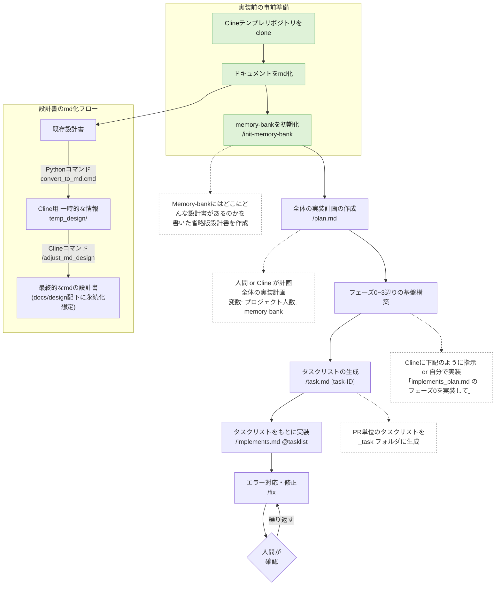

```mermaid
flowchart TB
  %% --- Styles ---
  classDef prep fill:#dff2d8,stroke:#7dbf7d,color:#111;
  classDef note fill:#fff,stroke:#999,stroke-dasharray: 3 3,color:#333;

  %% --- Pre-implementation prep (green box) ---
  subgraph PRE[実装前の事前準備]
    direction TB
    A[Clineテンプレリポジトリをclone]:::prep --> B[ドキュメントをmd化]:::prep --> C[memory-bankを初期化<br/>/init-memory-bank]:::prep
  end

  %% --- Design-doc conversion flow (top right) ---
  subgraph DOCFLOW[設計書のmd化フロー]
    direction LR
    X[既存設計書] -->|Pythonコマンド<br/>convert_to_md.cmd| Y[Cline用 一時的な情報<br/>temp_design/]
    Y -->|Clineコマンド<br/>/adjust_md_design| Z["最終的なmdの設計書<br/>(docs/design配下に永続化想定)"]
  end

  %% Link between prep and docflow
  B --> X

  %% --- Main implementation workflow (vertical) ---
  C --> D[全体の実装計画の作成<br/>/plan.md]
  D --> E[フェーズ0~3辺りの基盤構築]
  E --> F["タスクリストの生成<br/>/task.md [task-ID]"]
  F --> G[タスクリストをもとに実装<br/>/implements.md @tasklist]
  G --> H[エラー対応・修正<br/>/fix]
  H --> I{人間が<br/>確認}
  I -->|繰り返す| H

  %% --- Notes / Annotations ---
  N1[Memory-bankにはどこにどんな設計書があるのかを<br/>書いた省略版設計書を作成]:::note
  C -.-> N1

  N2[人間 or Cline が計画<br/>全体の実装計画<br/>変数: プロジェクト人数, memory-bank]:::note
  D -.-> N2

  N3[Clineに下記のように指示 or 自分で実装<br/>「implements_plan.md のフェーズ0を実装して」]:::note
  E -.-> N3

  N4[PR単位のタスクリストを<br/>_task フォルダに生成]:::note
  F -.-> N4


```