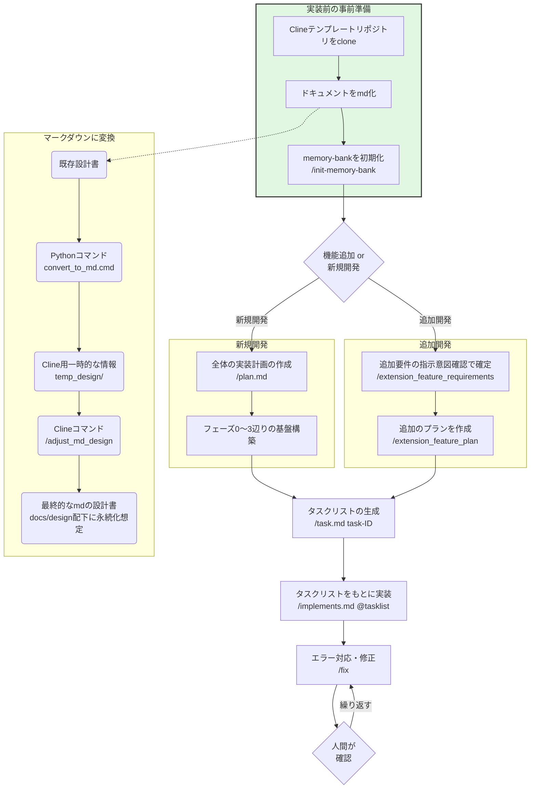

```mermaid
flowchart TB
    %% --- スタイル定義 ---
    classDef greenFill fill:#e1f7e1,stroke:#333,stroke-width:2px
    classDef note fill:#fff,stroke:#333,stroke-dasharray: 5 5

    %% --- 実装前の事前準備 ---
    subgraph Prep["実装前の事前準備"]
        direction TB
        CloneRepo["Clineテンプレートリポジトリをclone"]
        DocToMd["ドキュメントをmd化"]
        InitMB["memory-bankを初期化<br>/init-memory-bank"]
    end
    class Prep greenFill

    %% --- 新規開発 ---
    subgraph NewDev["新規開発"]
        direction TB
        PlanMd["全体の実装計画の作成<br>/plan.md"]
        InfraBuild["フェーズ0〜3辺りの基盤構築"]
    end

    %% --- 追加開発 ---
    subgraph AddDev["追加開発"]
        direction TB
        ExtReq["追加要件の指示意図確認で確定<br>/extension_feature_requirements"]
        ExtPlan["追加のプランを作成<br>/extension_feature_plan"]
    end

    %% --- 詳細フロー: マークダウン変換 ---
    %% 修正点: ここを明確に記述し、古い環境でも動くように標準記法に変更
    subgraph ToMd["マークダウンに変換"]
        ExistingDoc("既存設計書")
        PyCmd("Pythonコマンド<br>convert_to_md.cmd")
        TempInfo("Cline用一時的な情報<br>temp_design/")
        ClineCmd("Clineコマンド<br>/adjust_md_design")
        FinalMD("最終的なmdの設計書<br>docs/design配下に永続化想定")
    end

    %% --- 接続定義 ---
    CloneRepo --> DocToMd
    DocToMd --> InitMB

    %% DocToMdからの点線接続
    DocToMd -.-> ExistingDoc
    
    %% ToMd内部の接続
    ExistingDoc --> PyCmd
    PyCmd --> TempInfo
    TempInfo --> ClineCmd
    ClineCmd --> FinalMD

    %% メインフローの分岐
    InitMB --> Decision{"機能追加 or<br>新規開発"}
    
    Decision -- 新規開発 --> PlanMd
    PlanMd --> InfraBuild
    
    Decision -- 追加開発 --> ExtReq
    ExtReq --> ExtPlan
    
    %% 合流と実装
    GenTask["タスクリストの生成<br>/task.md task-ID"]
    InfraBuild --> GenTask
    ExtPlan --> GenTask
    
    GenTask --> Impl["タスクリストをもとに実装<br>/implements.md @tasklist"]
    Impl --> Fix["エラー対応・修正<br>/fix"]
    Fix --> Check{"人間が<br>確認"}
    Check -- 繰り返す --> Fix
```
