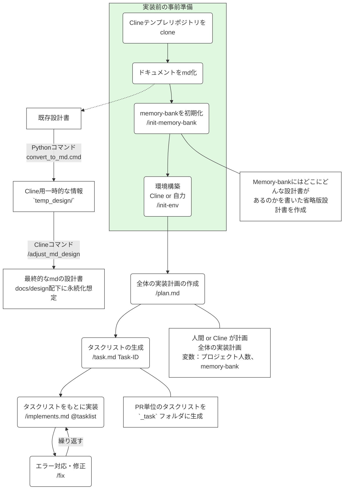

```mermaid
graph TD
    %% スタイル定義
    classDef default fill:#fff,stroke:#333,stroke-width:1px;
    classDef greenGroup fill:#e0f7e0,stroke:#333,stroke-width:1px;
    classDef note fill:none,stroke:none;

    %% 事前準備サブグラフ
    subgraph Prep [実装前の事前準備]
        direction TB
        Clone("Clineテンプレリポジトリをclone")
        MD("ドキュメントをmd化")
        InitMB("memory-bankを初期化<br>/init-memory-bank")
        Env("環境構築<br>Cline or 自力<br>/init-env")

        Clone --> MD
        MD --> InitMB
        InitMB --> Env
    end
    class Prep greenGroup

    %% ドキュメント変換フロー（右側）
    Existing["既存設計書"]
    Temp["Cline用一時的な情報<br>`temp_design/`"]
    Final["最終的なmdの設計書<br>docs/design配下に永続化想定"]

    MD -.-> Existing
    Existing -- "Pythonコマンド<br>convert_to_md.cmd" --> Temp
    Temp -- "Clineコマンド<br>/adjust_md_design" --> Final

    %% メインフロー続き
    Plan("全体の実装計画の作成<br>/plan.md")
    Task("タスクリストの生成<br>/task.md Task-ID")
    Impl("タスクリストをもとに実装<br>/implements.md @tasklist")
    Fix("エラー対応・修正<br>/fix")

    Env --> Plan
    Plan --> Task
    Task --> Impl
    Impl --> Fix
    Fix -- "繰り返す" --> Impl

    %% 注釈（右側）
    NoteMB["Memory-bankにはどこにどんな設計書が<br>あるのかを書いた省略版設計書を作成"]
    InitMB --- NoteMB

    NotePlan["人間 or Cline が計画<br>全体の実装計画<br>変数：プロジェクト人数、memory-bank"]
    Plan --- NotePlan

    NoteTask["PR単位のタスクリストを<br>`_task` フォルダに生成"]
    Task --- NoteTask

    %% 注釈のスタイル適用
    class NoteMB,NotePlan,NoteTask note```

```