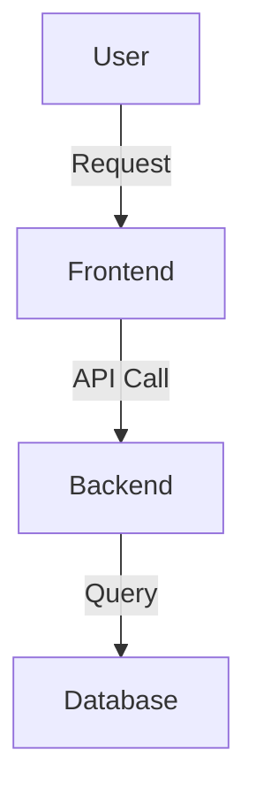
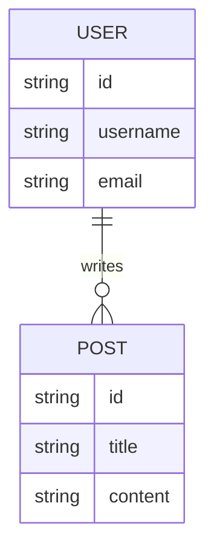

# System Patterns

## アーキテクチャ概要
[全体的なアーキテクチャスタイルを記述してください。例: モノリス、マイクロサービス、イベント駆動。主要な技術スタックコンポーネントの役割も含めてください。]

### システム図

## **主要な技術的意思決定**

* **[決定 1]:** [決定内容] - [理由と背景、却下された代替案]
* **[決定 2]:** [決定内容] - [理由と背景、却下された代替案]

## **デザインパターン**

### **グローバルパターン**

* **[パターン名]:** [どこでどのように使用されているか。例: API レスポンスのための Facade パターン]

### **コンポーネントパターン**

* **フロントエンド:** [フロントエンド固有のパターン。例: Container/Presentational, Custom Hooks]
* **バックエンド:** [バックエンド固有のパターン。例: Repository Pattern]

## **コンポーネント間の関係**

* **[コンポーネント A]** は **[コンポーネント B]** と [プロトコル/メソッド] を介して通信します。
* **データフロー:** [データがシステム内をどのように移動するかを記述]
* **依存関係:** [依存関係のルール。例: ドメイン層はインフラストラクチャに依存してはならない]

## **データモデル / データベース設計**

[Mermaid ER図やクラス図を使用してスキーマ定義を記述します]

## **重要な実装パス**

* **[パス名, 例: ユーザー認証]:** [ステップバイステップのフロー、セキュリティ要件]
* **[パス名, 例: 支払いフロー]:** [トランザクション管理、エラー処理の詳細]

## **アンチパターン (やってはいけないこと)**

* ❌ [アンチパターン 1: 例: UI からの直接 DB アクセス]
* ❌ [アンチパターン 2: 例: マジックナンバー]
* ❌ [アンチパターン 3: 例: 非推奨ライブラリの使用]

## **テスト戦略**

* **単体テスト:** [スコープ、モック戦略、ツール]
* **統合テスト:** [環境、データベースの取り扱い]
* **E2E テスト:** [主要なユーザーフローのカバレッジ]
