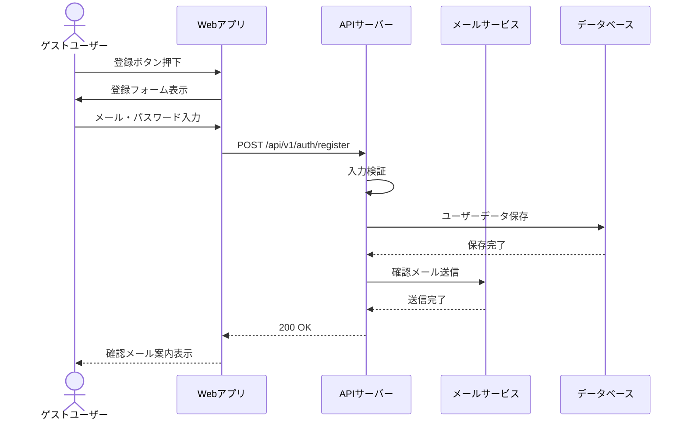
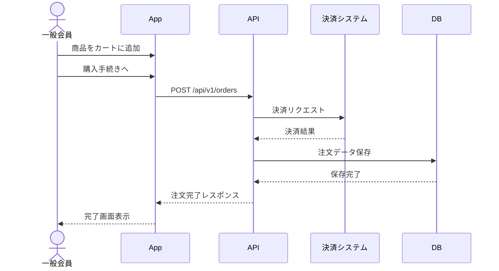
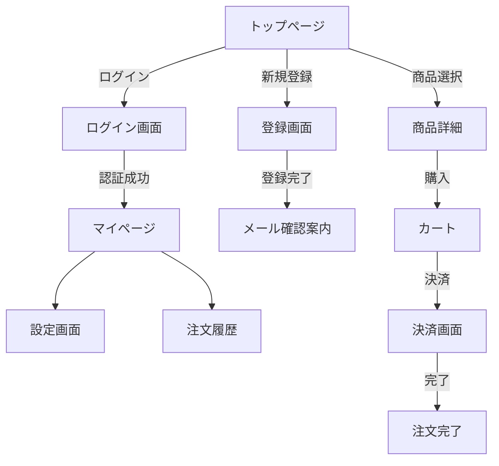

# 1. はじめに
## 1.1 文書管理
| 版数 | 日付 | 改訂内容 | 作成者 |
|---|---|---|---|
| v0.1 | YYYY-MM-DD | 初版作成 | Name |

## 1.2 参考資料
- 例: `templates/design/01_basic_design.md`（機能一覧 / 画面遷移）
- 例: `templates/design/screen/<feature-name>_screen_design.md`（画面仕様）
- 例: `templates/design/db/03_db_design.md`（ER図 / テーブル定義）
- 例: `templates/design/02_api_design.md`（API IF / OpenAPI）
- 例: `templates/design/04_architecture_design.md`（アーキテクチャ / ディレクトリ構成）
- 例: `templates/design/05_non_functional_requirements.md`（非機能要件）
- 例: `templates/design/09_roles_permissions.md`（権限 / ロール）

## 1.3 前提条件・制約条件
### 1.3.1 前提条件
- 対象ユーザー: （例）既存会員10,000名、新規訪問者月間50,000名
- 既存システム: （例）旧会員システムからのデータ移行が必要
- 利用環境: （例）PC・スマートフォンブラウザからのアクセス

### 1.3.2 制約条件
- 開発期間: （例）3ヶ月（設計1ヶ月、実装2ヶ月）
- 予算: （例）XXX万円
- 技術的制約: （例）IE11サポート不要、モダンブラウザのみ対応
- 法的制約: （例）個人情報保護法、特定商取引法の遵守
- その他: （例）既存サービスとのAPI互換性維持が必要

# 2. アクター定義 (Actors)
> システムを利用する人物や外部システムを定義する。

| Actor ID | アクター名 | 説明 | 主な利用機能 |
|---|---|---|---|
| A-01 | ゲストユーザー | 未ログイン状態の訪問者 | 商品閲覧、会員登録 |
| A-02 | 一般会員 | 登録済みのユーザー | ログイン、購入、マイページ管理 |
| A-03 | 管理者 | システム運用担当者 | ユーザー管理、コンテンツ管理 |
| A-04 | 外部決済システム | 決済処理を行う外部API | 決済確認、返金処理 |

# 3. 機能一覧 (Functional Requirements)
> システムが提供する機能を列挙する。

| ID | 機能名 | 概要 | 優先度 | 対応アクター |
|---|---|---|---|---|
| F-01 | ユーザー登録 | メール/パスワードでの新規登録 | 高 | A-01 (ゲスト) |
| F-02 | ログイン | 登録済みユーザーの認証 | 高 | A-01 (ゲスト) |
| F-03 | マイページ | 自身の情報閲覧・編集 | 中 | A-02 (一般会員) |
| F-04 | 商品購入 | カート追加から決済完了まで | 高 | A-02 (一般会員) |
| F-05 | 注文履歴閲覧 | 過去の購入履歴を確認 | 中 | A-02 (一般会員) |

# 4. ユースケース記述 (Use Cases)
> 主要なユースケースの詳細を記述する。

## 4.1 UC-01: ユーザー登録
| 項目 | 内容 |
|---|---|
| **ユースケースID** | UC-01 |
| **ユースケース名** | ユーザー登録 |
| **アクター** | A-01 (ゲストユーザー) |
| **事前条件** | ユーザーがシステムにアクセスしている |
| **事後条件** | 新規ユーザーアカウントが作成され、確認メールが送信される |
| **基本フロー** | 1. ユーザーが「新規登録」ボタンをクリック 2. システムが登録フォームを表示 3. ユーザーがメールアドレス、パスワードを入力 4. システムが入力値を検証 5. システムがアカウントを作成 6. システムが確認メールを送信 7. ユーザーがメール内のリンクをクリックして認証完了 |
| **代替フロー** | 4a. 入力値が不正な場合、エラーメッセージを表示 4b. メールアドレスが既に登録済みの場合、エラーメッセージを表示 |
| **例外フロー** | 6a. メール送信に失敗した場合、再送機能を提供 |

## 4.2 UC-02: ログイン
| 項目 | 内容 |
|---|---|
| **ユースケースID** | UC-02 |
| **ユースケース名** | ログイン |
| **アクター** | A-01 (ゲストユーザー) |
| **事前条件** | ユーザーが登録済みアカウントを持っている |
| **事後条件** | ユーザーがログイン状態となり、会員機能が利用可能になる |
| **基本フロー** | 1. ユーザーが「ログイン」ボタンをクリック 2. システムがログインフォームを表示 3. ユーザーがメールアドレス、パスワードを入力 4. システムが認証を実行 5. システムがセッションを作成 6. システムがマイページへリダイレクト |
| **代替フロー** | 4a. 認証失敗時、エラーメッセージを表示 4b. アカウントがロックされている場合、ロック解除案内を表示 |
| **例外フロー** | - |

# 5. 業務フロー (Business Flow)
> 主要なユースケースの流れを記述する。

## 5.1 ユーザー登録フロー

## 5.2 購入フロー

# 6. 画面遷移図 (Screen Transition)

# 7. 共通仕様・非機能要件概略
> 詳細は `templates/design/05_non_functional_requirements.md` を参照。

- **対応ブラウザ**: （例）Chrome, Safari, Firefox, Edge (Latest 2 versions)
- **対応デバイス**: （例）PC (1024px以上)、タブレット、スマートフォン
- **多言語対応**: （例）日本語のみ (v1)、英語対応は将来検討
- **レスポンスタイム**: （例）画面表示2秒以内、API応答500ms以内
- **可用性**: （例）99.9% (月間停止時間43分以内)
- **セキュリティ**: （例）HTTPS必須、OWASP Top 10対応
- **ログ保存**: （例）操作ログ3ヶ月、エラーログ1年保存
- **バックアップ**: （例）日次自動バックアップ、7世代保持
