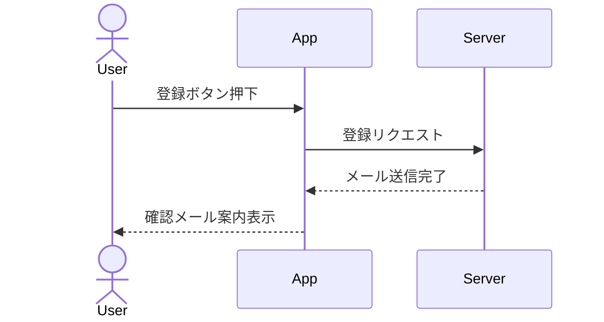
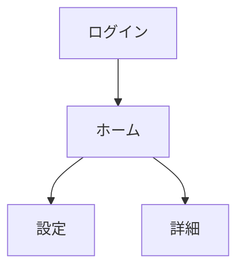

# 1. はじめに
## 1.1 文書管理
| 版数 | 日付 | 改訂内容 | 作成者 |
|---|---|---|---|
| v0.1 | YYYY-MM-DD | 初版作成 | Name |

## 1.2 参考資料
- 例: `templates/design/01_basic_design.md`（機能一覧 / 画面遷移）
- 例: `templates/design/screen/<feature-name>_screen_design.md`（画面仕様）
- 例: `templates/design/db/03_db_design.md`（ER図 / テーブル定義）
- 例: `templates/design/02_api_design.md`（API IF / OpenAPI）
- 例: `templates/design/04_architecture_design.md`（アーキテクチャ / ディレクトリ構成）
- 例: `templates/design/05_non_functional_requirements.md`（非機能要件）
- 例: `templates/design/09_roles_permissions.md`（権限 / ロール）

# 2. 機能一覧 (Functional Requirements)
> システムが提供する機能を列挙する。

| ID | 機能名 | 概要 | 優先度 | ロール |
|---|---|---|---|---|
| F-01 | ユーザー登録 | メール/パスワードでの新規登録 | 高 | Guest |
| F-02 | ログイン | 登録済みユーザーの認証 | 高 | Guest |
| F-03 | マイページ | 自身の情報閲覧・編集 | 中 | User |

# 3. 業務フロー (Business Flow)
> 主要なユースケースの流れを記述する。

# 4. 画面遷移図 (Screen Transition)

# 5. 共通仕様・非機能要件概略
- **対応ブラウザ**: （例）Chrome, Safari (Latest)
- **多言語対応**: （例）日本語のみ (v1)
- **ログ**: （例）操作ログを3ヶ月保存
