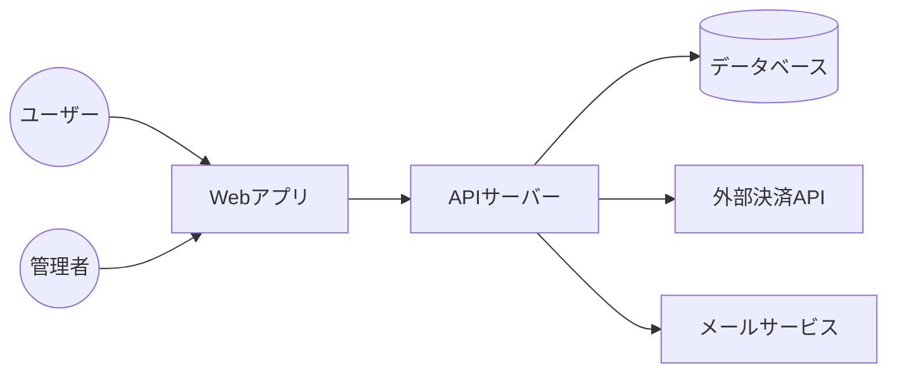
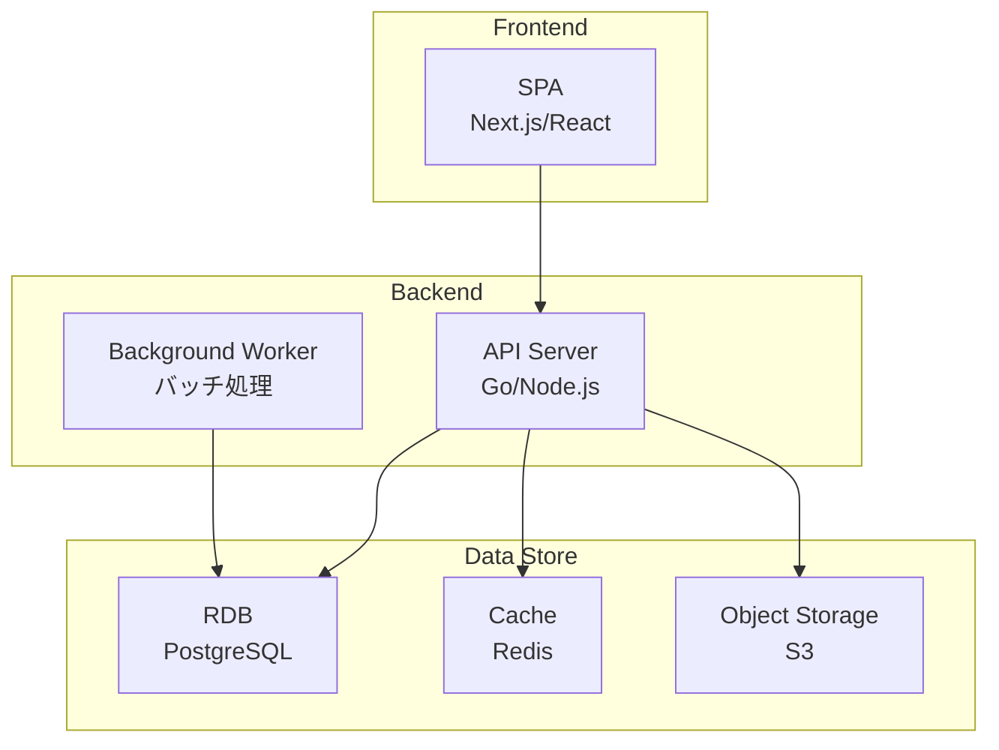
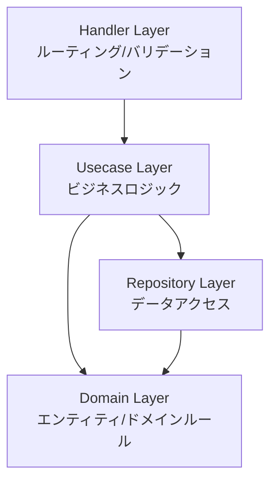
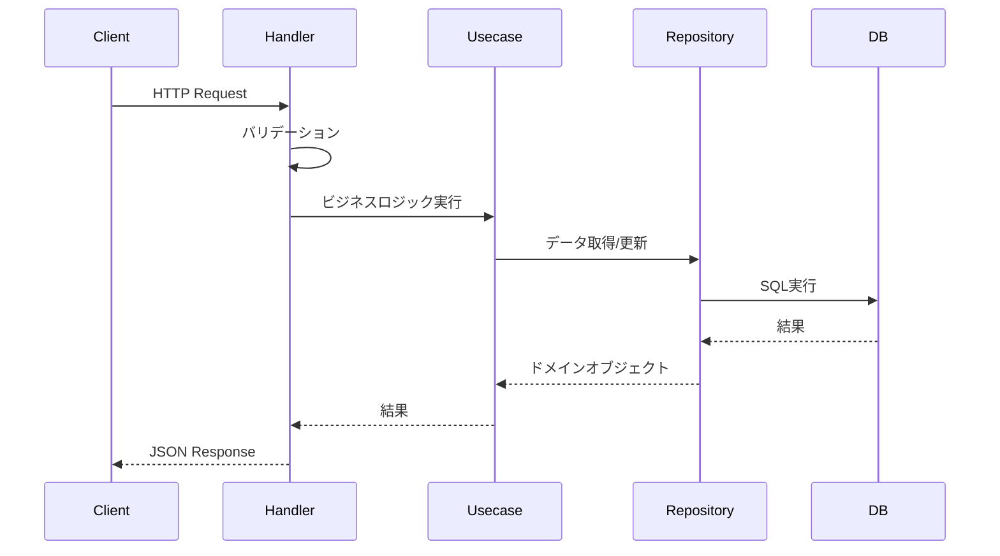
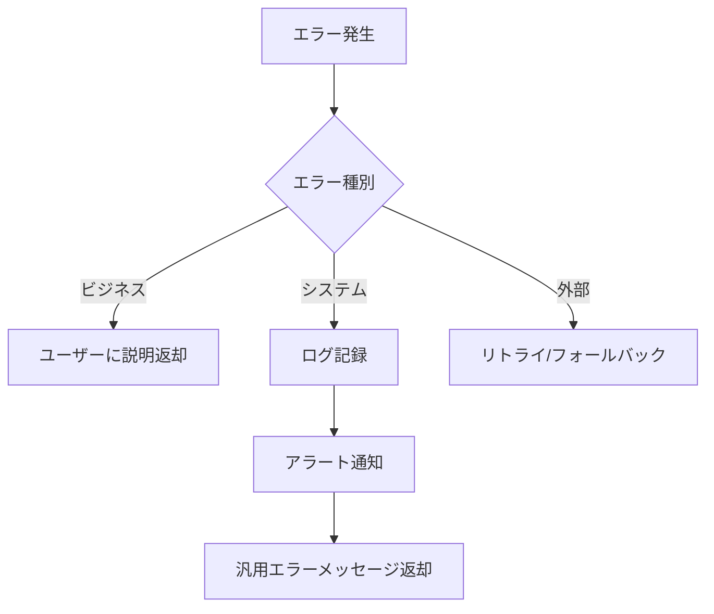

# 1. システム全体像 (C4 Model)
## 1.1 Context Diagram (コンテキスト図)
> システムと外部システム、ユーザーの関係を示す。



## 1.2 Container Diagram (コンテナ図)
> システムを構成する主要なコンテナ（実行可能ユニット）を示す。



## 1.3 Component Diagram (コンポーネント図)
> 各コンテナ内の主要なコンポーネントとその責務を示す。

**API Server 内部構造**:


# 2. 技術スタック
| カテゴリ | 技術要素 | バージョン | 選定理由 |
|---|---|---|---|
| フロントエンド | Next.js / React | | SEO, パフォーマンス |
| バックエンド | Go / Node.js | | 型安全性, 開発速度 |
| データベース | PostgreSQL | | 信頼性 |
| インフラ | AWS / GCP | | スケーラビリティ |

# 3. アプリケーションアーキテクチャ
## 3.1 ディレクトリ構成
```
/
├── frontend/
│   ├── src/
│   │   ├── components/
│   │   ├── pages/
│   │   └── hooks/
├── backend/
│   ├── cmd/
│   ├── internal/
│   │   ├── handler/
│   │   ├── usecase/
│   │   └── repository/
└── infra/
```

## 3.2 責務の分離 (レイヤードアーキテクチャ等)
- **Presentation Layer**: UI/APIハンドリング
- **Application Layer**: ビジネスロジックのフロー制御
- **Domain Layer**: ドメイン知識、エンティティ
- **Infrastructure Layer**: DB接続、外部API通信

# 4. データフロー
> 主要な処理（検索、更新など）のデータフローを記述。

## 4.1 通常のリクエストフロー


## 4.2 トランザクション処理
1. Usecaseレイヤーでトランザクションを開始
2. 複数のRepository操作を実行
3. エラー発生時はロールバック
4. 成功時はコミット

# 5. エラーハンドリング戦略
## 5.1 エラー分類
| カテゴリ | 説明 | HTTPステータス | ログレベル | 再試行可能性 |
|---|---|---|---|---|
| **ビジネスエラー** | 業務ルール違反 | 400, 422 | INFO | 不可 |
| **認証エラー** | 認証/認可失敗 | 401, 403 | WARN | 不可 |
| **リソース不在** | データが存在しない | 404 | INFO | 不可 |
| **システムエラー** | 予期せぬ内部エラー | 500 | ERROR | 可 |
| **外部サービスエラー** | 外部API失敗 | 502, 503 | ERROR | 可 |

## 5.2 エラーハンドリングフロー


## 5.3 エラーレスポンス形式
すべてのエラーレスポンスは統一形式を使用：
```json
{
  "error": {
    "code": "ERROR_CODE",
    "message": "ユーザー向けメッセージ",
    "details": [],
    "request_id": "req_xxx"
  }
}
```

# 6. セキュリティ設計方針
## 6.1 認証・認可
- **認証方式**: JWT (JSON Web Token)
- **トークン有効期限**: アクセストークン 15分、リフレッシュトークン 7日
- **パスワードハッシュ**: bcrypt (cost=12)
- **MFA**: TOTP対応 (将来検討)

## 6.2 通信セキュリティ
- **TLS**: TLS 1.3 推奨、最低 TLS 1.2
- **HSTS**: Strict-Transport-Security ヘッダー有効
- **CORS**: ホワイトリスト方式

## 6.3 データ保護
- **機密情報の暗号化**: 保存時に AES-256 で暗号化
- **個人情報**: GDPR/個人情報保護法遵守
- **ログマスキング**: パスワード、クレジットカード番号はログに記録しない

# 7. 依存関係管理
## 7.1 パッケージ管理
| 環境 | ツール | 設定ファイル |
|---|---|---|
| Frontend | npm/yarn/pnpm | package.json, package-lock.json |
| Backend | Go modules / npm | go.mod, package.json |

## 7.2 バージョン管理方針
- **メジャーバージョン固定**: セキュリティパッチ以外は固定
- **脱除パッケージ検知**: Dependabot / Renovate で自動検知
- **ライセンスチェック**: 商用利用可能なライセンスのみ許可 (MIT, Apache 2.0等)

## 7.3 モノレポ vs マイクロサービス
- **現状**: モノレポ (フロントエンドとバックエンドを同一リポジトリ管理)
- **将来**: スケールに応じてマイクロサービス化を検討

# 8. ADR (Architecture Decision Records)
> 重要なアーキテクチャ決定を記録する。

## ADR-001: フロントエンドフレームワークにNext.jsを採用
### ステータス
採用 (Accepted)

### コンテキスト
- SEO対応が必要
- 初期表示パフォーマンスが重要
- Reactの知見がチームにある

### 決定
Next.js 14 (App Router) を使用する

### 理由
1. SSR/SSGによるSEO最適化
2. ゼロコンフィグで開発効率が高い
3. Vercelでのデプロイが簡単
4. 画像最適化等の機能が充実

### 影響
- ビルド時間が増加する可能性
- Node.jsランタイムが必要

## ADR-002: データベースにPostgreSQLを採用
### ステータス
採用 (Accepted)

### コンテキスト
- 複雑なクエリが必要
- ACID特性が必要
- JSON型のサポートが役立つ

### 決定
PostgreSQL 15+ を使用する

### 理由
1. オープンソースでコストが低い
2. 高い信頼性とパフォーマンス
3. JSON/JSONB型による柔軟なデータモデリング
4. 豊富な拡張機能

### 影響
- 運用ノウハウが必要
- バックアップ・レプリケーション設定が必要
