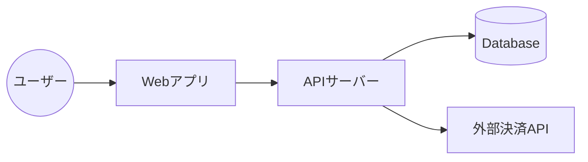

# 1. システム全体像
## 1.1 コンテキスト図
> システムと外部システム、ユーザーの関係を示す。



# 2. 技術スタック
| カテゴリ | 技術要素 | バージョン | 選定理由 |
|---|---|---|---|
| フロントエンド | Next.js / React | | SEO, パフォーマンス |
| バックエンド | Go / Node.js | | 型安全性, 開発速度 |
| データベース | PostgreSQL | | 信頼性 |
| インフラ | AWS / GCP | | スケーラビリティ |

# 3. アプリケーションアーキテクチャ
## 3.1 ディレクトリ構成
```
/
├── frontend/
│   ├── src/
│   │   ├── components/
│   │   ├── pages/
│   │   └── hooks/
├── backend/
│   ├── cmd/
│   ├── internal/
│   │   ├── handler/
│   │   ├── usecase/
│   │   └── repository/
└── infra/
```

## 3.2 責務の分離 (レイヤードアーキテクチャ等)
- **Presentation Layer**: UI/APIハンドリング
- **Application Layer**: ビジネスロジックのフロー制御
- **Domain Layer**: ドメイン知識、エンティティ
- **Infrastructure Layer**: DB接続、外部API通信

# 4. データフロー
> 主要な処理（検索、更新など）のデータフローを記述。

1. クライアントがAPIリクエスト送信
2. Handlerがリクエスト検証
3. Usecaseがビジネスロジック実行
4. RepositoryがDBアクセス
5. ...

# 5. セキュリティ設計方針
- 認証方式: <JWT / Session / OAuth>
- 通信暗号化: TLS 1.2+
- 機密情報の扱い: 環境変数、Secret Manager等の利用
