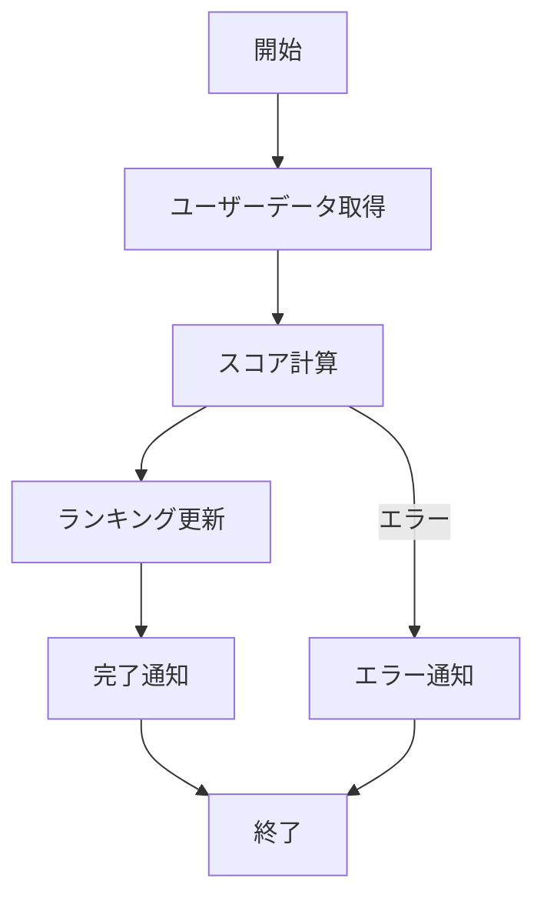

# 1. 概要
## 1.1 目的
- 毎日深夜にユーザーの集計を行い、ランキングテーブルを更新する。

## 1.2 実行方式
- **トリガー**: cron / EventBridge / Webhook
- **スケジュール**: 毎日 03:00 (JST)
- **想定実行時間**: 約10分
- **タイムアウト**: 30分

## 1.3 依存関係
### 1.3.1 前提バッチ（完了後に実行）
| バッチID | バッチ名 | 完了時刻 | 備考 |
|---|---|---|---|
| BATCH-000 | デイリーデータ集約 | 02:30 | 集約完了後に実行 |

### 1.3.2 後続バッチ（当バッチ完了後に実行）
| バッチID | バッチ名 | 開始時刻 | 備考 |
|---|---|---|---|
| BATCH-002 | メール通知バッチ | 03:15 | ランキング更新後に通知 |

### 1.3.3 並列実行不可バッチ
- BATCH-001 と BATCH-003 は同一テーブルを更新するため並列実行不可

# 2. 処理フロー

# 3. 入力・出力データ
## 3.1 入力
- Usersテーブル (全件)
- Ordersテーブル (過去30日分)

## 3.2 出力
- Rankingsテーブル (Delete -> Insert)
- Slack通知 (#batch-logs)

# 4. エラーハンドリング・リトライ
## 4.1 リトライ方針
- **自動リトライ**: あり (最大3回, 間隔1分)
- **手動リトライ**: 冪等性があるため、失敗時は手動で再実行可能

## 4.2 異常時の対応
- 処理が中断した場合、トランザクションはロールバックされること。
- エラーログにはスタックトレースを含めること。
- タイムアウト発生時は処理を強制終了し、アラートを発信。

# 5. 並列実行制御・排他制御
## 5.1 同時実行防止
### 5.1.1 実装方式
- **分散ロック**: Redis / DynamoDB を使用した分散ロック
- **ロックキー**: `batch:lock:{process_id}`
- **ロック有効期限**: 30分（タイムアウトと同じ）
- **ロック取得失敗時**: エラーログ出力して終了

### 5.1.2 ロック解放
- 正常終了時: 明示的にロックを解放
- エラー終了時: finally ブロックでロックを解放
- タイムアウト時: TTLにより自動解放

## 5.2 DBロック戦略
- **読み取りロック**: SELECT ... FOR UPDATE を使用
- **デッドロック対策**: ロック取得順序を統一（例: ID昇順）
- **ロックタイムアウト**: 10秒

## 5.3 冗長実行対策
- バッチが異常終了した場合、再実行時に冪等性を保証すること。
- 処理状態を管理テーブルに記録し、中断からの再開をサポート。

# 6. 監視・アラート
## 6.1 監視項目
| 項目 | 閾値 | アラートレベル | 通知先 |
|---|---|---|---|
| 実行時間 | 15分超過 | Warning | Slack |
| 実行失敗 | 1回でも失敗 | Critical | Slack + メール |
| 処理件数異常 | 前日比50%以下 | Warning | Slack |
| タイムアウト | 発生 | Critical | Slack + 電話 |

## 6.2 ログ出力
- **開始ログ**: バッチID、開始時刻、パラメータ
- **終了ログ**: バッチID、終了時刻、処理件数、実行時間、状態
- **進捗ログ**: 1000件処理毎に進捗状況を出力
- **エラーログ**: スタックトレース、エラー発生件数

## 6.3 メトリクス
- **実行回数**: 日次集計
- **平均実行時間**: 過去30日平均
- **失敗率**: 月次集計
- **処理件数トレンド**: 週次グラフ化

# 7. パフォーマンス目標
## 7.1 処理性能目標
- **1件あたりの処理時間**: 100ms 以内
- **バッチ全体の実行時間**: 10分以内（通常時）
- **最大処理件数**: 100,000件/日

## 7.2 スケーラビリティ
- **データ量増加時**: 処理を分割して並列実行を検討
- **最大並列度**: 4プロセスまで対応可能
- **パーティショニング**: ユーザーIDのレンジで分割

## 7.3 最適化方針
- **バルク処理**: INSERT/UPDATE は1000件ずつバルク実行
- **インデックス**: バッチ実行中は一時的にインデックスを無効化することを検討
- **キャッシュクリア**: バッチ終了後に関連キャッシュをクリア
