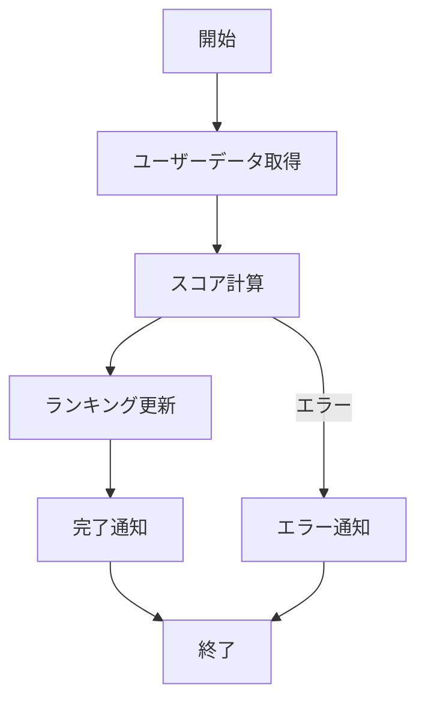

# 1. 概要
## 1.1 目的
- 毎日深夜にユーザーの集計を行い、ランキングテーブルを更新する。

## 1.2 実行方式
- **トリガー**: cron / EventBridge / Webhook
- **スケジュール**: 毎日 03:00 (JST)
- **想定実行時間**: 約10分

# 2. 処理フロー

# 3. 入力・出力データ
## 3.1 入力
- Usersテーブル (全件)
- Ordersテーブル (過去30日分)

## 3.2 出力
- Rankingsテーブル (Delete -> Insert)
- Slack通知 (#batch-logs)

# 4. エラーハンドリング・リトライ
## 4.1 リトライ方針
- **自動リトライ**: あり (最大3回, 間隔1分)
- **手動リトライ**: 冪等性があるため、失敗時は手動で再実行可能

## 4.2 異常時の対応
- 処理が中断した場合、トランザクションはロールバックされること。
- エラーログにはスタックトレースを含めること。
