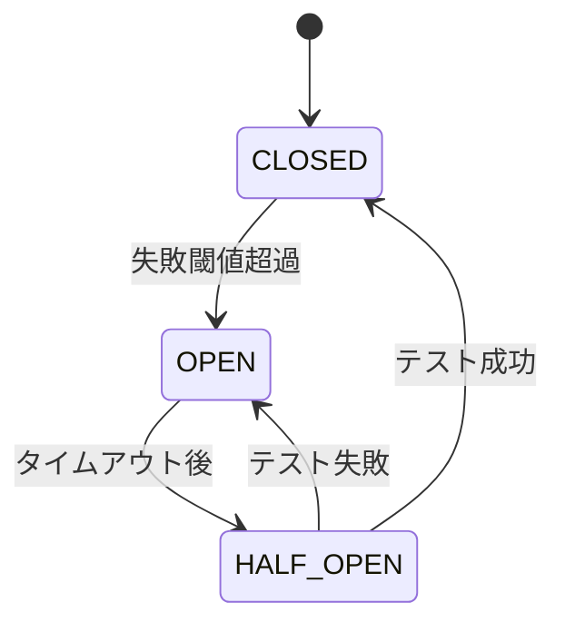

# 1. 連携概要
## 1.1 目的
- 決済処理を行うため、Stripe APIを利用する。
- ユーザーへのメール配信のため、SendGridを利用する。

## 1.2 接続方式
- **Protocol**: HTTPS (REST API)
- **Format**: JSON
- **Auth**: Bearer Token (API Key)

# 2. API仕様 (利用するエンドポイント)
## 2.1 決済作成 (POST /v1/charges)
- **用途**: 注文確定時に実行
- **Input**: amount, currency, source
- **Output**: charge_id, status

## 2.2 顧客作成 (POST /v1/customers)
- **用途**: 会員登録時に実行
- ...

# 3. エラーハンドリング・障害対策
## 3.1 タイムアウト設定
- Connection Timeout: 5s
- Read Timeout: 10s

## 3.2 リトライポリシー
- **対象エラー**: Network Error, 500, 502, 503, 504
- **非対象エラー**: 400, 401, 403, 404
- **回数**: 3回 (Exponential Backoff)

## 3.3 フォールバック
- 決済APIがダウンしている場合、「現在メンテナンス中です」を表示し、注文を受け付けない。
- メール送信APIが失敗した場合、キューに保存して後で再送。

## 3.4 サーキットブレーカー (Circuit Breaker)
### 3.4.1 設定値
| パラメータ | 値 | 説明 |
|---|---|---|
| 失敗閾値 | 5回/分 | これを超えるとOPEN状態へ |
| タイムアウト | 30秒 | OPEN状態の持続時間 |
| HALF_OPENテスト回数 | 2回 | 成功でCLOSED、失敗でOPENへ |

### 3.4.2 状態遷移


### 3.4.3 OPEN状態時の動作
- API呼び出しをスキップし、フォールバック処理を実行
- アラートを発信（外部APIが不安定）

# 4. ログ・監視
## 4.1 ログ出力
### 4.1.1 リクエストログ
```json
{
  "timestamp": "2024-01-01T10:00:00Z",
  "request_id": "req_abc123",
  "method": "POST",
  "url": "https://api.stripe.com/v1/charges",
  "headers": {"Authorization": "***MASKED***"},
  "body": {"amount": 1000, "currency": "jpy"},
  "duration_ms": 250
}
```

### 4.1.2 レスポンスログ
```json
{
  "timestamp": "2024-01-01T10:00:00Z",
  "request_id": "req_abc123",
  "status_code": 200,
  "body": {"id": "ch_xxx", "status": "succeeded"},
  "duration_ms": 250
}
```

### 4.1.3 エラーログ
- HTTPステータスコード
- エラーメッセージ
- リトライ回数
- サーキットブレーカー状態

## 4.2 監視項目
| カテゴリ | 項目 | 閾値 | アラート |
|---|---|---|---|
| レイテンシ | 平均応答時間 | 500ms超過 | Warning |
| エラー率 | 失敗率 | 5%超過 | Critical |
| サーキットブレーカー | OPEN状態 | 発生 | Critical |
| タイムアウト | タイムアウト回数 | 10回/分 | Warning |

## 4.3 ダッシュボード
- 外部API呼び出し回数（エンドポイント別）
- 平均レスポンスタイムの推移
- エラー率の推移
- サーキットブレーカー状態履歴

# 5. 契約・SLA情報
## 5.1 ベンダー情報
| 項目 | 内容 |
|---|---|
| ベンダー名 | Stripe, Inc. |
| 契約開始日 | 2024-01-01 |
| 契約期間 | 1年間（自動更新） |
| 担当者 | 開発部 山田太郎 |

## 5.2 SLA (Service Level Agreement)
| 項目 | 保証値 | 本番実績 |
|---|---|---|
| 稼働率 | 99.95% | 99.98% |
| 平均応答時間 | 300ms | 250ms |
| サポート対応時間 | 24時間以内 | - |

## 5.3 料金情報
- **基本料金**: $0 / 月（決済手数料のみ）
- **決済手数料**: 3.6%
- **上限額**: なし

## 5.4 サポート体制
- **問い合わせ窓口**: support@stripe.com
- **ドキュメント**: https://stripe.com/docs
- **ステータスページ**: https://status.stripe.com

# 6. テスト環境
## 6.1 Sandbox環境
- **Sandbox**: 利用可能 (テスト用APIキーを使用)
- **URL**: https://api.stripe.com/v1 (test mode)
- **APIキー**: `sk_test_xxx...`
- **テストカード**:
  - 成功: 4242 4242 4242 4242
  - 失敗: 4000 0000 0000 0002
  - 3Dセキュア: 4000 0000 0000 3220

## 6.2 データリセット
- Sandbox環境は毎週月曜日にリセットされる
- テストデータは自動生成スクリプトで再作成

# 7. モック・スタブ仕様
## 7.1 ローカル開発用モック
### 7.1.1 モックサーバー
- **ツール**: WireMock / MockServer / MSW
- **起動方法**: Docker Compose で自動起動
- **ポート**: localhost:8080

### 7.1.2 モックレスポンス例
**成功パターン**:
```json
{
  "id": "ch_mock_success",
  "object": "charge",
  "amount": 1000,
  "currency": "jpy",
  "status": "succeeded"
}
```

**失敗パターン**:
```json
{
  "error": {
    "type": "card_error",
    "code": "card_declined",
    "message": "カードが拒否されました"
  }
}
```

### 7.1.3 遅延・タイムアウトテスト
- 意図的に遅延を発生させるエンドポイントを用意
- 例: `/v1/charges?delay=5000` で5秒遅延

## 7.2 CI/CD用スタブ
- GitHub Actions 内でモックサーバーを起動
- E2Eテストで外部API呼び出しをモック化

# 8. セキュリティ
## 8.1 APIキー管理
- APIキーは環境変数またはSecret Managerで管理
- コードリポジトリにはコミットしない
- ローテーション: 6ヶ月に1回定期変更

## 8.2 通信セキュリティ
- TLS 1.2+ 必須
- 証明書検証を有効化
- ホスト名検証を有効化

## 8.3 ログマスキング
- APIキー、トークン、クレジットカード番号はログに出力しない
- 出力する場合は `***MASKED***` と表示
