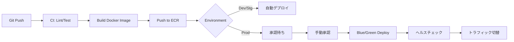

# 1. インフラ構成図
```mermaid
graph TD
    User --> CloudFront
    CloudFront --> S3[S3 (Frontend)]
    User --> ALB
    ALB --> ECS[ECS/Fargate (Backend)]
    ECS --> RDS[Aurora RDS (MySQL)]
    ECS --> Redis[ElastiCache]
```

# 2. リソース定義
## 2.1 コンピューティング
- **Frontend**: AWS S3 + CloudFront (SPA Hosting)
- **Backend**: AWS Fargate (Docker)
  - CPU: 2vCPU
  - Memory: 4GB
  - AutoScaling: 2 ~ 10 tasks

## 2.2 ネットワーク
- VPC: 10.0.0.0/16
- Subnets: Public (ALB, NAT), Private (ECS), Isolated (RDS)

# 3. デプロイパイプライン (CI/CD)
## 3.1 ワークフロー


1. GitHubへPush
2. GitHub Actions起動
   - Lint / Test / Security Scan
   - Build (Docker Image)
   - Tag: `{branch}-{commit-sha}-{timestamp}`
3. ECRへPush
4. ECSサービスの更新
   - Dev/Stg: Rolling Update
   - Prod: Blue/Green Deployment

## 3.2 環境分離
| 環境 | Branch | Trigger | URL |
|---|---|---|---|
| Dev | develop | Push | dev.example.com |
| Stg | main | Push | stg.example.com |
| Prod | tag (v*) | Manual Approval | example.com |

## 3.3 ロールバック手順
### 3.3.1 自動ロールバック
- デプロイ後のヘルスチェック失敗時、自動で前バージョンに戻す
- エラー率が5%超過した場合、アラートと共にロールバックを提案

### 3.3.2 手動ロールバック
```bash
# ECSタスク定義を前バージョンに戻す
aws ecs update-service \
  --cluster prod-cluster \
  --service app-service \
  --task-definition app-task:${PREVIOUS_VERSION}
```

### 3.3.3 データベースマイグレーション
- **Forward-only原則**: ロールバックできる設計にする
- **カラム追加**: ロールバック可能（前バージョンは新カラムを無視）
- **カラム削除**: 2ステップ必要（まず使用停止、次のリリースで削除）

# 5. IaC (Infrastructure as Code)
## 5.1 使用ツール
| ツール | 用途 | 管理対象 |
|---|---|---|
| **Terraform** | インフラプロビジョニング | VPC, ECS, RDS, S3 等 |
| **AWS CDK** | 代替案（TypeScript） | 同上 |
| **CloudFormation** | AWSネイティブ | 同上 |

## 5.2 ディレクトリ構成 (Terraform 例)
```
infra/
├── terraform/
│   ├── modules/
│   │   ├── network/
│   │   ├── compute/
│   │   └── database/
│   ├── environments/
│   │   ├── dev/
│   │   ├── stg/
│   │   └── prod/
│   └── backend.tf
└── README.md
```

## 5.3 状態管理
- **Backend**: S3 + DynamoDB (State Lock)
- **バージョン管理**: S3バージョニング有効
- **アクセス制御**: IAMロールで制限

## 5.4 CI/CD連携
- Terraform Plan: PR作成時に自動実行（変更内容をコメント）
- Terraform Apply: mainブランチマージ時に自動実行（Dev/Stg）
- Prod: 手動承認後に実行

# 6. コスト見積もり
## 6.1 月間コスト見積もり (USD)
| サービス | スペック | 単価 | 数量 | 月額 |
|---|---|---|---|---|
| ECS Fargate | 2vCPU, 4GB | $0.04/h | 2タスク | $60 |
| Aurora RDS | db.t3.medium | $0.08/h | 1インスタンス | $58 |
| ElastiCache | cache.t3.micro | $0.017/h | 1ノード | $12 |
| ALB | - | $22/月 + データ転送 | 1 | $30 |
| S3 | 標準 | $0.023/GB | 100GB | $2.3 |
| CloudFront | - | $0.085/GB | 1TB | $85 |
| **合計** | | | | **$247** |

## 6.2 コスト最適化方針
- **予約インスタンス**: RDS/ElastiCacheで1年予約で斜40%
- **オートスケーリング**: 低負荷時にインスタンス数を削減
- **S3 Lifecycle**: 古90日のデータをGlacierへ移動
- **CloudFront**: キャッシュ率を向上させてオリジンアクセスを削減

## 6.3 コスト監視
- AWS Cost Explorer で日次コストを確認
- 予算超過時にアラート（Budgets）
- タグ付けで環境別・サービス別にコストを分析

# 7. オブザーバビリティ設計 (Logs / Metrics / Traces)
## 7.1 ログ集約
### 7.1.1 アプリケーションログ
- **出力先**: CloudWatch Logs / Datadog
- **保持期間**: 30日（エラーログは1年）
- **フォーマット**: JSON構造化ログ

### 7.1.2 インフラログ
- ALBアクセスログ → S3
- VPC Flow Logs → CloudWatch Logs
- CloudTrail → S3 (監査用)

## 7.2 メトリクス
### 7.2.1 インフラメトリクス
- CPU/メモリ使用率
- ネットワーク帯域
- ディスクI/O

### 7.2.2 アプリケーションメトリクス
- リクエスト数 / エラー率
- レスポンスタイム (P50, P95, P99)
- データベースコネクション数

## 7.3 分散トレーシング
- **ツール**: AWS X-Ray / Datadog APM / Jaeger
- **サンプリング率**: 10% (コスト削減)
- **追跡対象**: HTTPリクエスト、DBクエリ、外部API呼び出し

## 7.4 ダッシュボード
- **インフラダッシュボード**: リソース使用率、コスト推移
- **アプリダッシュボード**: レスポンスタイム、エラー率、スループット
- **ビジネスダッシュボード**: ユーザー数、取引数、売上など
- 機密情報（DBパスワード等）は AWS Secrets Manager / Parameter Store で管理。
- アプリケーション起動時に環境変数として注入する。

| Key | Description | Dev Value | Prod Value |
|---|---|---|---|
| DB_HOST | DBホスト名 | dev-db... | prod-db... |
| API_KEY | 外部APIキー | test-key | (secret) |
