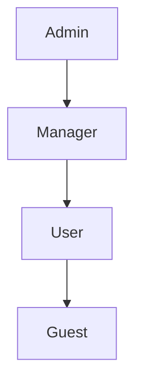

# 1. ロール定義 (Roles)
システムにおける役割を定義する。

| Role ID | Role Name | 説明 |
|---|---|---|
| R-01 | Admin | システム全体の管理が可能。 |
| R-02 | Manager | 自部門のデータの閲覧・編集が可能。 |
| R-03 | User | 自身のデータのみ閲覧・編集が可能。 |
| R-04 | Guest | ログイン前の利用者。公開情報のみ閲覧可。 |

# 2. 権限定義 (Permissions)
システムで実行可能な操作（権限）を定義する。

| Perm ID | Permission Name | 説明 |
|---|---|---|
| P-01 | user.view | ユーザー情報を閲覧する。 |
| P-02 | user.edit | ユーザー情報を編集する。 |
| P-03 | item.delete | 商品を削除する。 |

# 3. 権限マトリクス (RBAC Matrix)
ロールと権限の対応表。

| Permission / Role | Admin (R-01) | Manager (R-02) | User (R-03) | Guest (R-04) |
|---|:---:|:---:|:---:|:---:|
| user.view | ○ | ○ | ○ (自身のみ) | - |
| user.edit | ○ | ○ | ○ (自身のみ) | - |
| item.view | ○ | ○ | ○ | ○ |
| item.edit | ○ | ○ | - | - |
| item.delete | ○ | - | - | - |

# 4. 実装・制御方針
## 4.1 RBAC (Role-Based Access Control) 実装
### 4.1.1 API層
- **Middleware**: トークン内のRoleを確認し、エンドポイントごとのRequired Permissionと照合。
- **デコレータ例** (擬似コード):
```typescript
@RequirePermissions(['user.edit'])
@Controller('users')
export class UserController {
  @Put(':id')
  updateUser(@Param('id') id: string, @Body() data: any) {
    // 権限チェック済みでここに到達
  }
}
```

### 4.1.2 UI層
- **権限なしボタン**: 非表示またはDisabledにする
- **コンポーネント例**:
```jsx
{hasPermission('item.delete') && (
  <DeleteButton onClick={handleDelete} />
)}
```

### 4.1.3 データベース層
- Row Level Security (RLS) を使用することを検討
- 例: PostgreSQLの RLS でユーザーIDフィルタを自動適用

## 4.2 階層型ロール (Role Hierarchy)
### 4.2.1 継承関係


- **Admin**: Managerのすべての権限を継承
- **Manager**: Userのすべての権限を継承
- **User**: Guestのすべての権限を継承

### 4.2.2 実装方法
```typescript
const roleHierarchy = {
  Admin: ['Manager', 'User', 'Guest'],
  Manager: ['User', 'Guest'],
  User: ['Guest'],
  Guest: []
};

function hasPermission(userRole: string, requiredRole: string): boolean {
  return userRole === requiredRole || 
         roleHierarchy[userRole]?.includes(requiredRole);
}
```

## 4.3 ABAC (Attribute-Based Access Control) 拡張
### 4.3.1 属性ベースのアクセス制御
ロールだけでなく、属性（部門、地域、時間帯等）で制御。

| 属性タイプ | 例 | 制御内容 |
|---|---|---|
| 部門 | department=sales | 営業部のデータのみ閲覧可能 |
| 地域 | region=tokyo | 東京地域のデータのみ編集可能 |
| 時間帯 | time=business_hours | 営業時間外は読み取り専用 |
| データ状態 | status=draft | 下書き状態は作成者のみ編集可能 |

### 4.3.2 ポリシー記述例
```json
{
  "policy": "allow_edit_own_department_data",
  "effect": "allow",
  "actions": ["data.edit"],
  "conditions": {
    "department": "${user.department}",
    "status": ["draft", "in_review"]
  }
}
```

# 5. 権限変更・監査ログ
## 5.1 監査対象イベント
| イベント | ログ内容 | 保存期間 |
|---|---|---|
| ロール付与 | ユーザーID、付与されたロール、実行者、時刻 | 5年 |
| ロール削除 | ユーザーID、削除されたロール、実行者、時刻 | 5年 |
| 権限変更 | ロールID、変更内容、実行者、時刻 | 5年 |
| 権限確認 | ユーザーID、確認した権限、結果、時刻 | 1年 |

## 5.2 監査ログ形式
```json
{
  "event_type": "role_granted",
  "timestamp": "2024-01-01T10:00:00Z",
  "actor": {
    "user_id": "admin-001",
    "name": "Admin User"
  },
  "target": {
    "user_id": "user-123",
    "name": "Taro Yamada"
  },
  "changes": {
    "role_added": "Manager",
    "reason": "昇進による権限変更"
  },
  "request_id": "req_abc123"
}
```

## 5.3 アラート
- Adminロール付与時: セキュリティチームへ通知
- 深夜の権限変更: 異常操作としてアラート

# 6. テストケース
## 6.1 権限チェックテスト
| Test ID | ケース | 期待結果 |
|---|---|---|
| TC-01 | Adminがitem.deleteを実行 | 許可 |
| TC-02 | Userがitem.deleteを実行 | 拒否 (403 Forbidden) |
| TC-03 | Userが自身のuser.editを実行 | 許可 |
| TC-04 | Userが他人のuser.editを実行 | 拒否 (403 Forbidden) |
| TC-05 | Guestがitem.viewを実行 | 許可 |

## 6.2 階層型ロールテスト
| Test ID | ケース | 期待結果 |
|---|---|---|
| TC-06 | AdminがUser権限を必要とするエンドポイントを呼び出す | 許可（継承） |
| TC-07 | UserがManager権限を必要とするエンドポイントを呼び出す | 拒否 |
