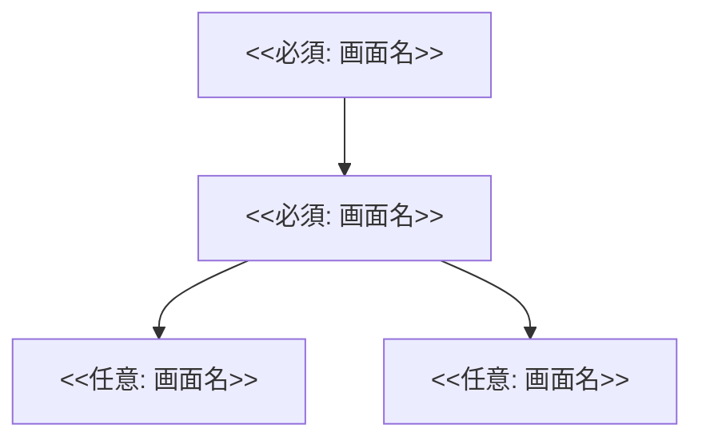

# 1. 機能一覧 (Functional Requirements)

> システムが提供する機能を列挙する。
>
> **入力ガイド**
>
> * `<<必須>>` は必ず埋める
> * `<<任意>>` は必要に応じて埋める
> * `<<例>>` はサンプルなので置き換える

| ID   | 機能名         | 概要         | 優先度           | ロール           |
| ---- | ----------- | ---------- | ------------- | ------------- |
| F-01 | <<必須: 機能名>> | <<必須: 概要>> | <<必須: 高/中/低>> | <<必須: 利用ロール>> |
| F-02 | <<必須: 機能名>> | <<必須: 概要>> | <<必須: 高/中/低>> | <<必須: 利用ロール>> |
| F-03 | <<必須: 機能名>> | <<必須: 概要>> | <<必須: 高/中/低>> | <<必須: 利用ロール>> |

> **記載例（必要なら削除）**
>
> * F-01: ユーザー登録 / メール・パスワードでの新規登録 / 高 / Guest

# 2. 業務フロー (Business Flow)

> 主要なユースケースの流れを記述する。

## 2.1 対象ユースケース

* <<必須: ユースケース名（例: ユーザー登録）>>

## 2.2 前提・条件

* <<任意: 前提条件（例: 未ログイン状態）>>
* <<任意: 例外条件（例: メールアドレス重複時）>>

## 2.3 シーケンス（Mermaid）

```mermaid
sequenceDiagram
    actor <<必須: アクター名（例: User）>>
    participant <<必須: クライアント（例: App）>>
    participant <<必須: サーバ/外部（例: Server）>>

    <<必須: ここからシーケンスを記述（例）>>
    %% User->>App: 登録ボタン押下
    %% App->>Server: 登録リクエスト
    %% Server-->>App: メール送信完了
    %% App-->>User: 確認メール案内表示
```

# 3. 画面遷移図 (Screen Transition)

> 画面ID・画面名を定義し、主要遷移を記載する。

## 3.1 画面一覧（任意）

| 画面ID | 画面名         | 概要         |
| ---- | ----------- | ---------- |
| S01  | <<必須: 画面名>> | <<任意: 概要>> |
| S02  | <<必須: 画面名>> | <<任意: 概要>> |
| S03  | <<必須: 画面名>> | <<任意: 概要>> |

## 3.2 遷移（Mermaid）


