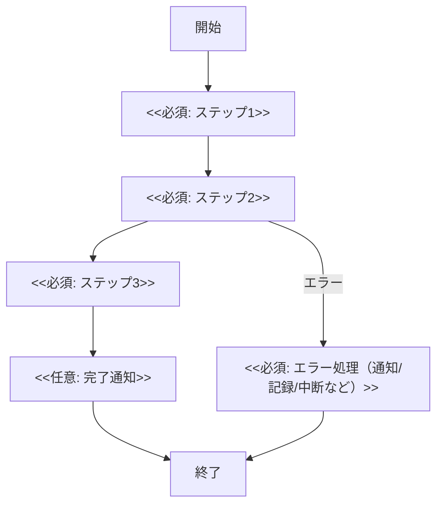

# 1. 概要
## 1.1 目的
- <<必須: この処理の目的を1〜3行で入力>>
  - <<例: 毎日深夜にユーザーの集計を行い、ランキングテーブルを更新する。>>

## 1.2 実行方式
- **トリガー**: <<必須: cron / EventBridge / Webhook / Queue / 手動 などから選択>>
- **スケジュール**: <<必須: 実行頻度と時刻 (例: 毎日 03:00 (JST))>>
- **想定実行時間**: <<任意: 目安 (例: 約10分)>>
- **実行環境**: <<必須: 実行基盤 (例: ECS/Fargate, Lambda, Kubernetes, Batch, Workerなど)>>
- **並列度/同時実行制御**: <<任意: 例: 同時実行不可 / 最大N並列 / ロック方式>>

# 2. 処理フロー
> 主要ステップと分岐（正常/異常）を記載する。

# 3. 入力・出力データ
## 3.1 入力
- <<必須: 入力データソース1（例: Usersテーブル 全件）>>
- <<必須: 入力データソース2（例: Ordersテーブル 過去30日分）>>
- <<任意: ファイル/外部API/キューなどがあれば追記>>

## 3.2 出力
- <<必須: 出力先1（例: Rankingsテーブル Delete -> Insert）>>
- <<任意: 出力先2（例: Slack通知 #batch-logs）>>
- <<任意: 生成ファイル/イベント発行などがあれば追記>>

## 3.3 データ更新方式（任意）
- **更新単位**: <<任意: 全件/差分/期間指定>>
- **競合/ロック**: <<任意: 行ロック/分散ロック/排他キーなど>>
- **冪等性キー**: <<任意: 例: 実行日(YYYYMMDD)をキーにする>>

# 4. エラーハンドリング・リトライ
## 4.1 リトライ方針
- **自動リトライ**: <<必須: あり/なし>>
  - 最大回数: <<必須: 数値>>
  - 間隔: <<必須: 例: 1分 / 指数バックオフ>>
  - 対象エラー: <<任意: タイムアウト/一時的なDB障害/外部API 5xxなど>>
- **手動リトライ**: <<必須: 可/不可>>
  - 理由/条件: <<任意: 冪等性の有無、再実行の手順など>>

## 4.2 異常時の対応
- **ロールバック方針**: <<必須: トランザクション境界とロールバック可否を記載>>
- **アラート/通知先**: <<必須: Slack/メール/PagerDutyなどと宛先>>
- **ログ方針**: <<必須: どこに何を出すか>>
  - <<例: エラーログにスタックトレースを含める>>
  - <<任意: 相関ID/実行ID/入力件数/処理件数/所要時間など>>
- **リカバリ手順**: <<任意: 失敗時の手順（再実行/補正/手動更新など）>>
