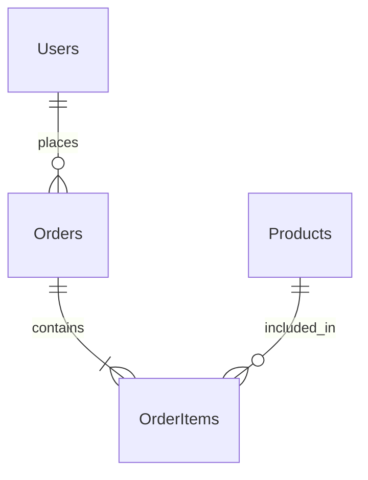

# 1. 概要
本ドキュメントは、プロジェクト全体のデータベース設計のインデックスである。
詳細なテーブル定義は、ドメインごとの分割ファイルを参照すること。

# 2. ドメイン構成一覧

大規模化に伴い、DB設計を以下のドメイン（サブシステム）単位で管理する。

| No | ドメイン名 | ファイルリンク | 概要 |
|---|---|---|---|
| 1 | Users | [01_users.md](./domains/01_users.md) | ユーザー、認証、プロフィール |
| 2 | Orders | [02_orders.md](./domains/02_orders.md) | 注文、決済、配送 |
| 3 | Products | [03_products.md](./domains/03_products.md) | 商品カタログ、在庫 |
| ... | ... | ... | ... |

# 3. 全体ER図 (High Level)
各ドメイン間の主要なリレーションのみを記載する。詳細は各ドメイン定義書を参照。

# 4. 共通設計方針

## 4.1 命名規則
- テーブル名: 英複数形 (スネークケース) 例: `users`, `order_items`
- カラム名: 英小文字 (スネークケース) 例: `user_id`, `created_at`
- PK: `id` (BIGINT)
- FK: `[table_singular]_id`

## 4.2 共通カラム定義
全テーブルに以下の監査カラムを付与することを推奨する。

| 論理名 | 物理名 | 型 | NULL | デフォルト | 備考 |
|---|---|---|---|---|---|
| 作成日時 | created_at | TIMESTAMP | No | CURRENT_TIMESTAMP | - |
| 更新日時 | updated_at | TIMESTAMP | No | CURRENT_TIMESTAMP | - |

## 4.3 データ保存ポリシー (Retention Policy)
各ドメインで個別定義がない限り、以下を適用する。
- バックアップ頻度: 1日1回
- 保持期間: 永久
- 削除方針: 論理削除を基本とする（ `deleted_at` カラムの利用など要検討）
