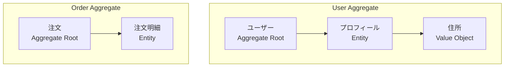
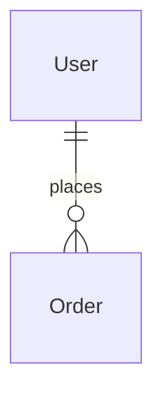

# [ドメイン名] ドメインDB設計書

## 1. ドメイン概要
| 項目 | 説明 |
|---|---|
| **ドメインスコープ** | このコンテキストの境界を記述する（例：「ユーザーIDと認証を管理する」）。 |
| **責務** | 主要な責務をリストアップする。 |
| **依存関係** | このドメインが依存している他のドメインをリストアップする。 |

### 1.1 Aggregate 境界 (DDD)
> Aggregateは一貫性を保つ必要があるエンティティの集まり。



**Aggregate ルール**:
1. Aggregate外からは Aggregate Root 経由でのみアクセス
2. 他のAggregateへの参照はIDのみ
3. トランザクションは1つのAggregate内で完結

### 1.2 ドメインイベント (Domain Events)
> ドメイン内で発生する重要な出来事。

| イベント名 | 発生タイミング | ペイロード | 購読者 |
|---|---|---|---|
| UserRegistered | ユーザー登録完了時 | userId, email, timestamp | メール送信サービス |
| UserProfileUpdated | プロフィール更新時 | userId, changes, timestamp | 検索インデックス更新 |
| OrderPlaced | 注文確定時 | orderId, items, amount | 在庫管理、通知 |

**イベントフォーマット例**:
```json
{
  "eventId": "evt_123",
  "eventType": "UserRegistered",
  "aggregateId": "user_456",
  "timestamp": "2024-01-01T10:00:00Z",
  "payload": {
    "userId": "user_456",
    "email": "user@example.com"
  },
  "metadata": {
    "correlationId": "req_abc",
    "causationId": "cmd_xyz"
  }
}
```

## 2. スキーマ図 (ER図 / グラフ)
Mermaid図を挿入するか、画像へのリンクを貼る。



## 3. データモデル
*データストアに適した形式（RDBMS, ドキュメントDB, KVS等）を選択して記述する。*

### 3.1 [エンティティ/テーブル名]
*   **タイプ**: [例: RDBMSテーブル, DynamoDBテーブル, MongoDBコレクション]
*   **説明**: エンティティの簡潔な説明。

#### スキーマ定義 (SQLスタイル)
| 論理名 | 物理名 | 型 | Key | Null | デフォルト | 説明 |
|---|---|---|---|---|---|---|
| ID | id | UUID | PK | No | - | - |
| 名前 | name | VARCHAR(255) | - | No | - | - |

#### スキーマ定義 (NoSQL/ドキュメントスタイル)
```jsonc
{
  "pk": "USER#<user_id>", // パーティションキー
  "sk": "PROFILE",        // ソートキー
  "attributes": {
    "displayName": "String",
    "email": "String",
    "preferences": {
      "theme": "String",
      "notifications": "Boolean"
    }
  }
}
```

#### アクセスパターン (NoSQLで重要)
| ID | アクセスパターン | クエリ / キー条件 | 備考 |
|---|---|---|---|
| AP1 | ユーザープロファイル取得 | PK=USER#<id> AND SK=PROFILE | - |

## 4. インデックスとパフォーマンス

### 4.1 ローカルインデックス (RDBMS / セカンダリインデックス)
| テーブル | インデックス名 | カラム構成 | ユニーク | タイプ | 備考 |
|---|---|---|---|---|---|
| users | idx_users_email | email | Yes | B-Tree | ログイン検索用 |

### 4.2 グローバルセカンダリインデックス (GSI) / 検索エンジン
*DynamoDB GSIやElasticsearchインデックスなどを使用する場合に定義する。*

## 5. セキュリティ・プライバシー
*   **PIIデータ**: PII（個人を特定できる情報）を含むフィールドをリストアップする（例：email, phone）。
*   **暗号化**: カラムレベルの暗号化が必要かどうかを明記する。
*   **アクセス制御**: RLSポリシーやアプリケーションレベルのスコープを定義する。

## 6. データライフサイクル・ストレージ
*   **推定データ量**: [例: 10kレコード/月]
*   **保持期間**: [例: 永久, 3年, TTL=90日]
*   **バックアップ戦略**: [例: ポイントインタイムリカバリ有効]

## 7. リポジトリインターフェース (Repository Pattern)
> データアクセスの抽象化。ドメイン層がインフラ層に依存しないようにする。

### 7.1 インターフェース定義
```typescript
// Domain Layer
interface UserRepository {
  // 基本操作
  findById(id: string): Promise<User | null>;
  findByEmail(email: string): Promise<User | null>;
  save(user: User): Promise<void>;
  delete(id: string): Promise<void>;
  
  // クエリ
  findAll(options: FindOptions): Promise<User[]>;
  count(criteria: SearchCriteria): Promise<number>;
  
  // トランザクション
  beginTransaction(): Promise<Transaction>;
  commit(tx: Transaction): Promise<void>;
  rollback(tx: Transaction): Promise<void>;
}
```

### 7.2 実装例 (Infrastructure Layer)
```typescript
// Infrastructure Layer
class PostgresUserRepository implements UserRepository {
  async findById(id: string): Promise<User | null> {
    const row = await this.db.query(
      'SELECT * FROM users WHERE id = $1',
      [id]
    );
    return row ? this.toDomain(row) : null;
  }
  
  private toDomain(row: any): User {
    // DBレコードからドメインモデルへ変換
    return new User({
      id: row.id,
      email: row.email,
      // ...
    });
  }
}
```

## 8. ビジネスルール・バリデーション
### 8.1 ドメイン不変条件 (Invariants)
> 常に維持されるべきルール。

| ルールID | ルール内容 | 検証タイミング |
|---|---|---|
| R-01 | メールアドレスは一意である必要がある | 保存時 |
| R-02 | 注文金額は0円より大きい必要がある | 生成時 |
| R-03 | ユーザーは最低1つのロールを持つ必要がある | 登録/更新時 |

### 8.2 バリデーションルール
| フィールド | ルール | エラーメッセージ |
|---|---|---|
| email | 形式チェック (RFC 5322) | "有効なメールアドレスを入力してください" |
| email | 長さ: 5-255文字 | "メールアドレスは5～255文字で入力してください" |
| password | 最低8文字 | "パスワードは8文字以上必要です" |
| password | 数字・英字混在 | "パスワードには数字と英字を含めてください" |
| age | 範囲: 0-150 | "有効な年齢を入力してください" |

### 8.3 実装例 (Domain Model)
```typescript
class User {
  constructor(
    private id: string,
    private email: Email, // Value Object
    private password: HashedPassword // Value Object
  ) {
    this.validate();
  }
  
  private validate(): void {
    if (!this.email.isValid()) {
      throw new InvalidEmailError();
    }
    // 他の不変条件チェック
  }
  
  changeEmail(newEmail: Email): void {
    // ビジネスルールを適用
    this.email = newEmail;
    this.validate();
    // ドメインイベント発行
    this.addDomainEvent(new UserEmailChanged(this.id, newEmail));
  }
}
```

## 9. テスト戦略
### 9.1 ユニットテスト
- ドメインモデルのビジネスルールをテスト
- Value Objectの不変性をテスト
- Repositoryのモックを使用

### 9.2 統合テスト
- 実際のDBを使用したリポジトリテスト
- トランザクションの動作確認
- インデックスの効果確認
