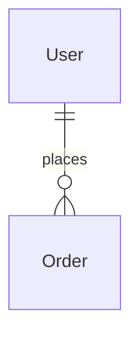

# [ドメイン名] ドメイン設計書

## 1. ドメイン概要
| 項目 | 説明 |
|---|---|
| **ドメインスコープ** | このコンテキストの境界を記述する（例：「ユーザーIDと認証を管理する」）。 |
| **責務** | 主要な責務をリストアップする。 |
| **依存関係** | このドメインが依存している他のドメインをリストアップする。 |

## 2. スキーマ図 (ER図 / グラフ)
Mermaid図を挿入するか、画像へのリンクを貼る。



## 3. データモデル
*データストアに適した形式（RDBMS, ドキュメントDB, KVS等）を選択して記述する。*

### 3.1 [エンティティ/テーブル名]
*   **タイプ**: [例: RDBMSテーブル, DynamoDBテーブル, MongoDBコレクション]
*   **説明**: エンティティの簡潔な説明。

#### スキーマ定義 (SQLスタイル)
| 論理名 | 物理名 | 型 | Key | Null | デフォルト | 説明 |
|---|---|---|---|---|---|---|
| ID | id | UUID | PK | No | - | - |
| 名前 | name | VARCHAR(255) | - | No | - | - |

#### スキーマ定義 (NoSQL/ドキュメントスタイル)
```jsonc
{
  "pk": "USER#<user_id>", // パーティションキー
  "sk": "PROFILE",        // ソートキー
  "attributes": {
    "displayName": "String",
    "email": "String",
    "preferences": {
      "theme": "String",
      "notifications": "Boolean"
    }
  }
}
```

#### アクセスパターン (NoSQLで重要)
| ID | アクセスパターン | クエリ / キー条件 | 備考 |
|---|---|---|---|
| AP1 | ユーザープロファイル取得 | PK=USER#<id> AND SK=PROFILE | - |

## 4. インデックスとパフォーマンス

### 4.1 ローカルインデックス (RDBMS / セカンダリインデックス)
| テーブル | インデックス名 | カラム構成 | ユニーク | タイプ | 備考 |
|---|---|---|---|---|---|
| users | idx_users_email | email | Yes | B-Tree | ログイン検索用 |

### 4.2 グローバルセカンダリインデックス (GSI) / 検索エンジン
*DynamoDB GSIやElasticsearchインデックスなどを使用する場合に定義する。*

## 5. セキュリティ・プライバシー
*   **PIIデータ**: PII（個人を特定できる情報）を含むフィールドをリストアップする（例：email, phone）。
*   **暗号化**: カラムレベルの暗号化が必要かどうかを明記する。
*   **アクセス制御**: RLSポリシーやアプリケーションレベルのスコープを定義する。

## 6. データライフサイクル・ストレージ
*   **推定データ量**: [例: 10kレコード/月]
*   **保持期間**: [例: 永久, 3年, TTL=90日]
*   **バックアップ戦略**: [例: ポイントインタイムリカバリ有効]
