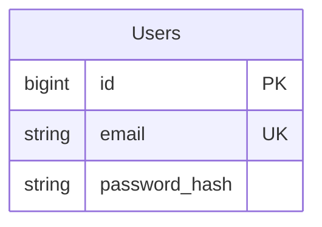

# Users Domain Design

## 1. Domain ER Diagram

## 2. Entity List
| エンティティ     | 役割（業務的な意味）            | 主キー(PK)                  | 主要な一意制約(UK)              | 代表ユースケース         | 備考       |
| ---------- | --------------------- | ------------------------ | ------------------------ | ---------------- | -------- |
| Users      | ログイン主体となるユーザーを表す | id                       | email                    | 認証、プロフィール表示 | PII含む等 |

## 3. Table Definitions

### 3.1 Users (ユーザー)
| 論理名 | 物理名 | 型 | NULL | PK | FK | デフォルト | 備考 |
|---|---|---|---|---|---|---|---|
| ID | id | BIGINT | No | Yes | - | AUTO_INCREMENT | - |
| メールアドレス | email | VARCHAR(255) | No | - | - | - | ユニーク |
| 作成日時 | created_at | TIMESTAMP | No | - | - | CURRENT_TIMESTAMP | - |
| 更新日時 | updated_at | TIMESTAMP | No | - | - | CURRENT_TIMESTAMP | - |

## 4. Domain Specific Indexes
| テーブル名 | インデックス名 | カラム構成 | ユニーク | 備考 |
|---|---|---|---|---|
| Users | idx_users_email | email | Yes | ログイン検索用 |
