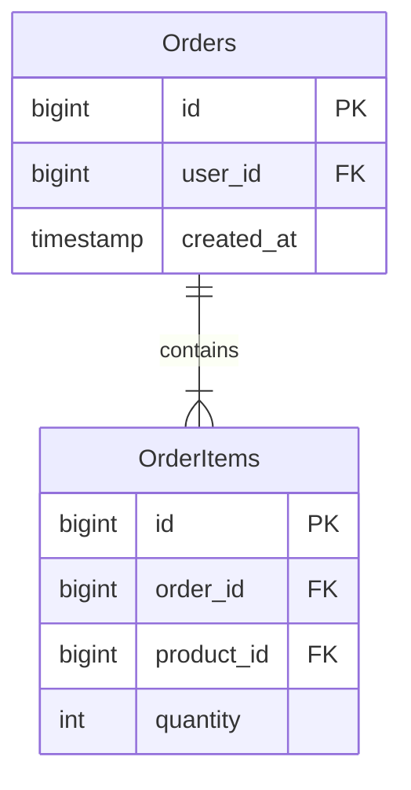

# Orders Domain Design

## 1. Domain ER Diagram

## 2. Entity List
| エンティティ     | 役割（業務的な意味）            | 主キー(PK)                  | 主要な一意制約(UK)              | 代表ユースケース         | 備考       |
| ---------- | --------------------- | ------------------------ | ------------------------ | ---------------- | -------- |
| Orders     | 注文ヘッダを表す            | id                       | order_no（任意）             | 購入履歴、配送状況確認 |          |
| OrderItems | 注文明細（注文内の行）を表す      | id / (order_id, line_no) | (order_id, line_no) | 注文内容の表示     |          |

## 3. Table Definitions

### 3.1 Orders (注文)
| 論理名 | 物理名 | 型 | NULL | PK | FK | デフォルト | 備考 |
|---|---|---|---|---|---|---|---|
| ID | id | BIGINT | No | Yes | - | AUTO_INCREMENT | - |
| ユーザーID | user_id | BIGINT | No | - | Yes | - | Users.id参照 |
| 作成日時 | created_at | TIMESTAMP | No | - | - | CURRENT_TIMESTAMP | - |

### 3.2 OrderItems (注文明細)
| 論理名 | 物理名 | 型 | NULL | PK | FK | デフォルト | 備考 |
|---|---|---|---|---|---|---|---|
| ID | id | BIGINT | No | Yes | - | AUTO_INCREMENT | - |
| 注文ID | order_id | BIGINT | No | - | Yes | - | Orders.id参照 |
| 商品ID | product_id | BIGINT | No | - | Yes | - | Products.id参照 |
