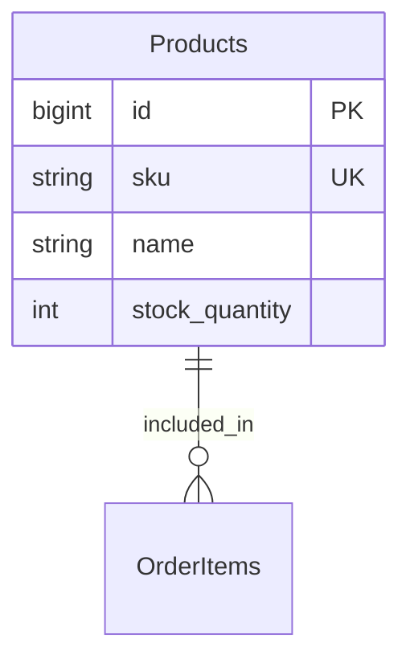

# Products Domain Design

## 1. Domain ER Diagram

## 2. Entity List
| エンティティ     | 役割（業務的な意味）            | 主キー(PK)                  | 主要な一意制約(UK)              | 代表ユースケース         | 備考       |
| ---------- | --------------------- | ------------------------ | ------------------------ | ---------------- | -------- |
| Products   | 商品マスタを表す            | id                       | sku                      | 商品一覧、在庫連携   |          |

## 3. Table Definitions

### 3.1 Products (商品)
| 論理名 | 物理名 | 型 | NULL | PK | FK | デフォルト | 備考 |
|---|---|---|---|---|---|---|---|
| ID | id | BIGINT | No | Yes | - | AUTO_INCREMENT | - |
| SKU | sku | VARCHAR(50) | No | - | - | - | 商品コード |
| 商品名 | name | VARCHAR(255) | No | - | - | - | - |
