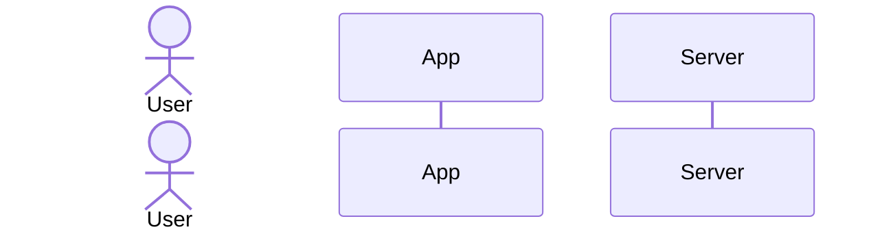

# 1. 拡張機能概要

> 追加したい拡張機能の概要を記述する。
>
> **入力ガイド**
>
> * `<<必須>>` は必ず埋める
> * `<<任意>>` は必要に応じて埋める
> * `<<例>>` はサンプルなので置き換える

## 1.1 目的・背景

* **目的**: <<必須: 拡張機能を追加する目的>>
* **背景**: <<任意: なぜこの機能が必要になったか>>

## 1.2 期待される効果

* <<必須: 拡張機能による効果・メリット>>
* <<任意: 追加の効果>>

---

# 2. 機能要件

## 2.1 機能詳細

| 項目     | 内容                              |
| ------ | ------------------------------- |
| 機能名    | <<必須: 拡張機能名>>                   |
| 機能種別   | <<必須: 画面/API/バッチ/その他>>          |
| 対象ロール  | <<必須: この機能を利用するロール>>            |
| 影響範囲   | <<必須: 新規追加/既存機能変更>>              |
| 関連機能ID | <<任意: 既存機能との関連 (例: F-01, F-02)>> |

## 2.2 ユースケース

> この拡張機能がどのような場面で使われるかを記述する。

1. **ユースケース名**: <<必須: ユースケース名>>
   - **アクター**: <<必須: 誰が操作するか>>
   - **トリガー**: <<必須: 何をきっかけに実行されるか>>
   - **事前条件**: <<任意: 実行前に満たすべき条件>>
   - **事後条件**: <<任意: 実行後の状態>>
   - **基本フロー**:
     1. <<必須: ステップ1>>
     2. <<必須: ステップ2>>
     3. <<任意: ステップ3>>

## 2.3 入出力仕様

### 入力

| 項目名    | 型     | 必須  | 説明             |
| ------ | ----- | --- | -------------- |
| <<項目名>> | <<型>> | <<Y/N>> | <<説明>>         |

### 出力

| 項目名    | 型     | 説明             |
| ------ | ----- | -------------- |
| <<項目名>> | <<型>> | <<説明>>         |

---

# 3. 非機能要件

## 3.1 パフォーマンス

* **レスポンスタイム**: <<任意: 目標値 (例: 2秒以内)>>
* **同時接続数**: <<任意: 想定値>>
* **データ量**: <<任意: 想定データ量>>

## 3.2 セキュリティ

* <<任意: 認証・認可要件>>
* <<任意: データ保護要件>>

## 3.3 その他制約

* <<任意: 技術的制約>>
* <<任意: 運用上の制約>>

---

# 4. 既存システムへの影響

## 4.1 影響を受けるコンポーネント

| コンポーネント名 | 影響内容         | 影響度      |
| -------- | ------------ | -------- |
| <<コンポーネント名>> | <<変更・追加・削除>> | <<高/中/低>> |

## 4.2 データベース変更

* **テーブル追加**: <<任意: 追加するテーブル名>>
* **カラム追加**: <<任意: 追加するカラム (テーブル名.カラム名)>>
* **マイグレーション**: <<任意: 必要な移行作業>>

## 4.3 API変更

* **新規エンドポイント**: <<任意: 追加するAPI>>
* **既存エンドポイント変更**: <<任意: 変更するAPI>>

---

# 5. UI/UX要件（画面機能の場合）

## 5.1 画面要件

* **画面名**: <<任意: 画面名>>
* **画面遷移元**: <<任意: どこからアクセスするか>>
* **デザイン参考**: <<任意: 参考URL・スクリーンショット>>

## 5.2 操作フロー

---

# 6. テスト要件

## 6.1 テスト観点

| テスト種別       | テスト内容          | 優先度      |
| ---------- | -------------- | -------- |
| ユニットテスト    | <<テスト内容>>      | <<高/中/低>> |
| 結合テスト      | <<テスト内容>>      | <<高/中/低>> |
| E2Eテスト     | <<テスト内容>>      | <<高/中/低>> |

## 6.2 受け入れ条件

* [ ] <<必須: 受け入れ条件1>>
* [ ] <<必須: 受け入れ条件2>>
* [ ] <<任意: 受け入れ条件3>>

---

# 7. 補足情報

## 7.1 参考資料

* <<任意: 参考URL、ドキュメント>>

## 7.2 質問・確認事項

* [ ] <<任意: 確認が必要な事項>>
* [ ] <<任意: 不明点>>

## 7.3 備考

* <<任意: その他の補足情報>>
