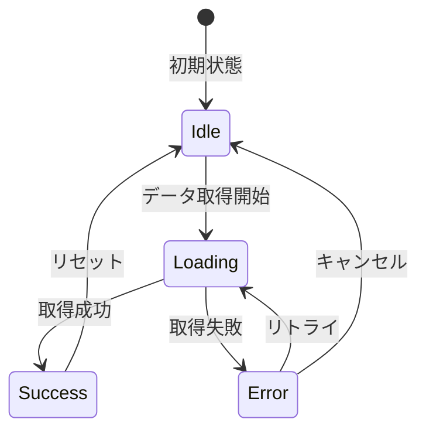

# 1. 画面概要
## 1.1 目的
- ユーザーがXXXXを行えるようにする。

## 1.2 ユーザー層
- 一般ユーザー / 管理者
- 必要権限: `user.view`

## 1.3 アクセシビリティ要件 (a11y)
| 項目 | 対応内容 |
|---|---|
| **WCAGレベル** | AA準拠 |
| **キーボード操作** | Tabキーで全要素にアクセス可能 |
| **スクリーンリーダー** | 適切なaria-label、role属性を付与 |
| **コントラスト比** | 4.5:1 以上 |
| **フォーカス表示** | 明確なフォーカスインジケータ |
| **エラー通知** | 視覚的 + aria-liveで音声通知 |

## 1.4 レスポンシブ対応
| デバイス | ブレークポイント | レイアウト調整 |
|---|---|---|
| **モバイル** | ~767px | 単一カラム、ハンバーガーメニュー |
| **タブレット** | 768px~1023px | 2カラムレイアウト |
| **PC** | 1024px~ | 3カラムレイアウト、サイドバー表示 |

# 2. UIイメージ (Wireframe)
> 画像貼付け、または簡単なテキスト図、Mermaidなどで記述。

```
+-----------------------------------+
|  [Logo]                 [Menu]    |
+-----------------------------------+
|  [Page Title]                     |
|                                   |
|  Label: [ Input Field ]           |
|  Label: [ Select Box  ] v         |
|                                   |
|       [ Submit Button ]           |
+-----------------------------------+
```

# 3. 画面要素定義 (Elements)
| No | 項目名 | 種別 | 表示条件/初期値 | 編集可否 | バリデーション |
|---|---|---|---|---|---|
| 1 | ユーザー名 | Text | ログイン中ユーザー | 不可 | - |
| 2 | 商品カテゴリ | Select | APIより取得 | 可 | 必須 |
| 3 | 検索ボタン | Button | 常時 | - | - |

# 4. イベント処理 (Actions)
## 4.1 初期表示 (OnLoad)
1. API `GET /categories` をコールし、カテゴリ選択肢を取得する。
2. ローディングを表示する。
3. 取得完了後、Selectボックスにセットする。

## 4.2 検索ボタン押下 (OnClick)
1. 入力値をチェックする。
2. API `GET /items` をパラメータ付きでコールする。
3. 結果を一覧エリアに描画する。

# 5. 状態遷移
- 正常終了時: [S-002] 一覧画面へ遷移
- エラー時: ダイアログを表示し、遷移しない

# 6. エラーハンドリング
| ケース | メッセージ | 挙動 |
|---|---|---|
| 必須入力なし | "必須項目です" | 入力欄下に赤字表示 |
| 入力形式不正 | "メールアドレスの形式が正しくありません" | 入力欄下に赤字表示 |
| APIエラー (500) | "システムエラーが発生しました" | トースト通知 |
| ネットワークエラー | "通信エラーが発生しました" | リトライボタン表示 |

# 7. ステート管理 (State Management)
## 7.1 ステート一覧
| ステート名 | 型 | 初期値 | 説明 |
|---|---|---|---|
| `isLoading` | boolean | false | ローディング状態 |
| `data` | array | [] | 取得したデータ |
| `error` | string \| null | null | エラーメッセージ |
| `selectedCategory` | string | '' | 選択中のカテゴリ |
| `isEmpty` | boolean | false | データが空かどうか |

## 7.2 ステート遷移図


## 7.3 各ステートのUI表示
| ステート | 表示内容 |
|---|---|
| **Idle** | 初期フォーム表示 |
| **Loading** | スピナー表示、ボタン無効化 |
| **Success (データあり)** | データ一覧表示 |
| **Success (データなし)** | 「データがありません」メッセージ |
| **Error** | エラーメッセージ + リトライボタン |

# 8. コンポーネント分割
## 8.1 コンポーネント構成
```
SearchPage (Container)
├── Header (Presentational)
├── SearchForm (Container)
│   ├── CategorySelect (Presentational)
│   └── SearchButton (Presentational)
├── LoadingSpinner (Presentational)
├── ResultList (Container)
│   └── ResultItem (Presentational) x N
└── ErrorMessage (Presentational)
```

## 8.2 コンポーネント詳細
| コンポーネント名 | 種別 | 責務 | 再利用性 |
|---|---|---|---|
| SearchPage | Container | 状態管理、API呼び出し | 低 |
| SearchForm | Container | フォーム状態管理 | 中 |
| CategorySelect | Presentational | セレクトボックス表示 | 高 |
| SearchButton | Presentational | ボタン表示 | 高 |
| ResultList | Container | 一覧表示ロジック | 中 |
| ResultItem | Presentational | 個別アイテム表示 | 高 |

## 8.3 再利用可能コンポーネント
- `CategorySelect` → 他の画面でもカテゴリ選択に使用
- `SearchButton` → デザインシステムの共通ボタンとして使用
- `LoadingSpinner` → 全画面で共通使用

# 9. デザインシステム連携
## 9.1 使用するデザイントークン
| カテゴリ | トークン名 | 値 | 用途 |
|---|---|---|---|
| Color | `--color-primary` | #007bff | ボタン、リンク |
| Color | `--color-error` | #dc3545 | エラーメッセージ |
| Spacing | `--spacing-md` | 16px | 要素間の余白 |
| Font | `--font-size-base` | 16px | 本文テキスト |
| Font | `--font-weight-bold` | 700 | 見出し |

## 9.2 コンポーネントライブラリ
- **UIフレームワーク**: Material-UI / Ant Design / Chakra UI
- **アイコン**: Heroicons / Feather Icons
- **フォームライブラリ**: React Hook Form / Formik

## 9.3 UI一貫性チェックリスト
- [ ] ボタンのスタイルがデザインシステムに準拠している
- [ ] 色使いがブランドガイドラインに沿っている
- [ ] フォントサイズが一貫している
- [ ] 余白（Spacing）が統一されている
- [ ] アイコンのスタイルが統一されている
