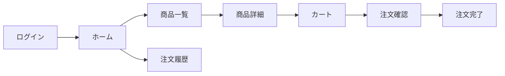

# 1. 概要

## 1.1 目的

* チームで並行実装しつつ、依存関係を崩さず効率的に開発する
* この計画書をもとにメンバーへ **ざっくりタスク** を割り振る（詳細タスクは各ブランチ/Issueで作成）
* 設計ドキュメントに基づき、手戻りのない実装ラインを構築する
* この計画書をもとにメンバーへタスクを割り振り、進捗を管理する

## 1.2 成果物（最終ゴール）

* リリース対象: <Webアプリケーション>, <APIサーバー>

  * 例: Web（Next.js）, API（Go/Node.js）
* リリース形態: 初期リリース (MVP)
* リリース日（目標）: YYYY-MM-DD

## 1.3 スコープ

### In Scope

* <機能を列挙>

  * 例: **ユーザー・認証**: 登録(F-01)、ログイン(F-02)、マイページ(F-03)
  * 例: **商品**: 商品一覧、商品詳細、在庫管理
  * 例: **注文**: 注文作成、注文履歴
  * 例: **管理機能**: 商品管理ダッシュボード

### Out of Scope（今回やらない）

* 例: 決済ゲートウェイ連携（モックで対応）
* 例: 複雑なプロモーション/クーポン機能
* 例: 高度な分析・レポーティング基盤

## 1.4 前提・制約

* 技術スタック:

  * Frontend: Next.js / React
  * Backend: Go (or Node.js)
  * Database: PostgreSQL
  * Infra: Docker / AWS/GCP
* アーキテクチャ: レイヤードアーキテクチャ (Presentation, Application, Domain, Infrastructure)
* 体制/人数: <例: FE2名、BE2名、QA1名…>

## 1.5 参照ドキュメント

* 例: `templates/design/01_basic_design.md`（機能一覧 / 画面遷移）
* 例: `templates/design/screen/<feature-name>_screen_design.md`（画面仕様）
* 例: `templates/design/db/03_db_design.md`（ER図 / テーブル定義）
* 例: `templates/design/02_api_design.md`（API IF / OpenAPI）
* 例: `templates/design/04_architecture_design.md`（アーキテクチャ / ディレクトリ構成）
* 例: `templates/design/05_non_functional_requirements.md`（非機能要件）
* 例: `templates/design/09_roles_permissions.md`（権限 / ロール）

---

# 2. 開発の進め方（チーム戦略）

## 2.1 チーム構成と役割分担

複数人で並行実装しつつ品質を担保するため、以下のような役割分担を推奨します。

> ポイント: 全員が「自分の担当範囲のDRI（Directly Responsible Individual）」を持つ。曖昧さをなくす。

| ロール                   | 人数目安 | 主な責務                     | 担当領域                         |
| --------------------- | ---- | ------------------------ | ---------------------------- |
| **Tech Lead**         | 1名   | アーキテクチャ決定、共通基盤実装、コードレビュー | 基盤 / 難易度高の機能                 |
| **Frontend Engineer** | 1-2名 | UIコンポーネント実装、画面結合、API繋ぎ込み | Presentation Layer           |
| **Backend Engineer**  | 1-2名 | API実装、DB設計・構築、ビジネスロジック   | Application / Domain / Infra |
| **QA / PM**           | 1名   | 仕様策定、受入テスト、進捗管理          | 要件 / テスト                     |

## 2.2 タスクの割り振り方（衝突を減らす戦略）

### 原則

* **境界で割る**: ドメイン（Users / Products / Orders など）または機能スライス単位に担当を固定し、同じファイルを複数人が同時編集しない。
* **共通基盤は集中実装**: セットアップ/CI/認証/共通UIなどはTech Lead（+サポート）で先に整備し、以降の実装を並列化する。
* **決める人を決める**: 迷いが出やすい論点（API形式/認証方式/エラー形式）はDRIを置き、議論を短時間で収束させる。

### 割り振りパターン（おすすめ）

* **縦割り（推奨）**: 1ドメインを1人（または1ペア）が「DB → API → UI」まで持つ（手戻りが最小・認知負荷が低い）。
* **横割り（専門性重視）**: FE/BEで分ける場合は **Contract First（API IF先行）** + **モック/スタブ** で待ち時間を消す。

### 例: 3人チーム（TL + FE + BE）

* TL: 基盤（CI/環境/共通規約）と、レビュー・設計合意の最終責任
* FE: 画面/コンポーネントと、OpenAPIクライアント等のIF同期
* BE: DB/Usecase/API実装（認証とコアドメイン）

### 例: 5人チーム（TL + FE2 + BE2）

* Users / Products / Orders で **ドメインDRI** を置き、相互にレビューして局所最適を防ぐ
* FEは「画面群」で割る（例: カタログ系 / 管理画面系）と衝突が減る

## 2.3 ブランチ/タスク運用

* **ブランチ戦略**: GitHub Flow (mainブランチ守り)

  * feature/xxx ブランチで開発し、PRでマージ。
* **タスク粒度**:

  * 1タスク = 1 PR を基本とする（大きすぎない粒度）。
  * 例: 「商品一覧API実装」「商品一覧UI実装」「DBマイグレーション作成」
* **先行着手**:

  * **Interface First**: APIのIF（OpenAPI等）を最初に合意し、FE/BEが並走できるようにする。

## 2.4 並行開発を成立させる鍵（Contract / Stub / Feature Flag）

* **Contract First**: OpenAPI（or gRPC proto）をPRで合意し、破壊的変更は必ずレビュー対象にする。
* **Stub First**: FEはAPIモック（MSW等）で先行し、BEはハンドラのスケルトン（200/4xx/5xx）から埋める。
* **Feature Flag**: 未完の機能はフラグで隠し、mainに小さくマージして統合コストを下げる。

## 2.5 PR設計のルール（レビュー滞留と衝突を防ぐ）

* 目安: **0.5〜1日で完了** / **差分は小さく**（レビューが30分以内で終わるサイズ）
* ルール: 「DB変更 + API変更 + UI変更」を同一PRに詰め込み過ぎない（結合が必要な場合はスライスとして意図的にまとめる）
* 進捗可視化: `templates/<feature-name>_tasks.md` をコピーし、PRの受け入れ基準と変更ファイルを明記する

## 2.6 進捗管理（おすすめの運用）

* カンバン（Backlog / Ready / In Progress / Review / Done）で管理し、**WIPは1人1件** を基本にする
* 定例:

  * デイリー（15分）: ブロッカー共有・依存関係の早期発見
  * 週次（30〜60分）: スコープ調整・次スプリントの合意
  * レトロ（30分）: 衝突/手戻りの原因を次に反映

## 2.7 Definition of Done（DoD）

* 受け入れ基準が満たされ、主要ケースの手動確認が完了
* テスト（ユニット/統合/スモーク）の追加、または不要な理由が明記されている
* ログ/エラーハンドリング/認可（必要な場合）が実装されている
* 設計・IF・マイグレーションが最新である（設計差分がある場合は先に更新）

## 2.8 開発フロー（並行作業のコツ）

1. **設計固定**: DB設計とAPI IFをTech Lead中心に固める。
2. **基盤実装**: 共通コンポーネント、ベースレイアウト、認証基盤を先行実装。
3. **ドメイン並行**: 「ユーザー」「商品」「注文」のドメインごとに担当を割り振り並行開発。

   * **BE**: DB → Repository → UseCase → Handler の順で実装。
   * **FE**: UIコンポーネント → ページ実装 → ダミーデータでの挙動確認 → API繋ぎ込み。

---

# 3. 依存関係の整理（最重要）

## 3.1 機能・画面一覧（カタログ）

> ここで「何があるか」と「依存」を固定し、実装順と並行作業を成立させる。

### 機能カタログ（例）

* [F-01] 認証
* [F-02] ユーザー設定
* [F-03] 商品一覧
* [F-04] 商品詳細
* [F-05] 注文作成
* [F-06] 注文履歴
* [F-07] 管理：商品管理
* [F-08] 管理：注文管理

### 画面カタログ（例）

* [S-01] ログイン
* [S-02] ホーム
* [S-03] 商品一覧
* [S-04] 商品詳細
* [S-05] カート
* [S-06] 注文確認
* [S-07] 注文完了
* [S-08] 注文履歴

## 3.2 依存関係マトリクス（ざっくりでOK）

| ID   | 種別 | 名称   | 依存（前提）          | 後続（これを待つ）    | 備考      |
| ---- | -- | ---- | --------------- | ------------ | ------- |
| F-01 | 機能 | 認証   | -               | F-02, S-02以降 | 認可も含むか？ |
| S-03 | 画面 | 商品一覧 | F-03(API)       | S-04         | -       |
| S-04 | 画面 | 商品詳細 | F-04(API), S-03 | S-05         | -       |

## 3.3 画面遷移（Mermaid）

---

# 4. モック方針（遷移先がスコープ外/未実装の場合）

## 4.1 ルール

* 遷移先の画面が タスクのスコープ外 かつ 未実装 の場合、該当タスク内では モック画面 を用意してつなぐ
* モックは「遷移の成立」「UI検証」「結合ポイント固定」が目的（本実装の代替ではない）

## 4.2 モックの定義（例）

* モック画面ID: S-MOCK-xx
* 置き換え条件:
* API未完成 → モックデータ/スタブ
* 画面未完成 → モック画面（ダミーUI + 戻る/次へだけ）
* モック除去の責務:
* 後続タスクに「モック除去」チェックを含める

---

# 5. フェーズ別 実装計画（セットアップ〜リリースまで）

各フェーズは「並行可能な束」で切る。依存のあるものは先に“固定物（IF/モック/共通部品）”を作る。

## Phase 1: プロジェクトセットアップ（開発土台）

| 優先 | タスクID | 対象 | 依存 | 内容（ざっくり） | モック要否 | 担当 | PR/Issue |
| :--- | :--- | :--- | :--- | :--- | :--- | :--- | :--- |
| P0 | T-001 | Repo | - | リポジトリ作成/権限設定 | なし | | |
| P0 | T-002 | Env | T-001 | 環境構築（local/dev/stg/prodの雛形） | なし | | |
| P1 | T-003 | CI | T-001 | CI（lint/test/build）導入 | なし | | |
| P1 | T-004 | Base | T-001 | コーディング規約/フォーマッタ導入 | なし | | |
| P2 | T-005 | Obs | - | 監視/ログ/エラー通知の最小導入（可能なら） | なし | | |
| P1 | T-006 | Data | - | シード/ダミーデータ方針決定 & 最小整備 | なし | | |

## Phase 2: 画面遷移の骨格（並行開発を可能にする）

| 優先 | タスクID | 対象 | 依存 | 内容（ざっくり） | モック要否 | 担当 | PR/Issue |
| :--- | :--- | :--- | :--- | :--- | :--- | :--- | :--- |
| P0 | T-007 | Router | T-002 | ルーティング/ナビゲーション雛形（共通レイアウト） | なし | | |
| P0 | T-008 | Screen | T-007 | 画面コンテナ（空画面）を全カタログ分だけ先に作成（S-xx） | なし | | |
| P1 | T-009 | UI | T-007 | モック画面枠（S-MOCK）と共通コンポーネント（ボタン/フォーム等） | なし | | |
| P0 | T-010 | Auth | T-007 | 認可が絡む場合のガード（ログイン前後の遷移） | なし | | |

## Phase 3: ドメイン基盤（API/DB/共通モジュール）

| 優先 | タスクID | 対象 | 依存 | 内容（ざっくり） | モック要否 | 担当 | PR/Issue |
| :--- | :--- | :--- | :--- | :--- | :--- | :--- | :--- |
| P0 | T-011 | DB | T-002 | DBスキーマ最小セット（主要テーブル） | なし | | |
| P0 | T-012 | API | T-004 | APIの型/DTO/バリデーション方針 | なし | | |
| P0 | T-013 | Auth | Phase 2 | 認証（F-01）※依存が多いなら最優先 | なし | | |
| P1 | T-014 | Base | Phase 2 | 共通エラーハンドリング/ローディング/リトライ | なし | | |

## Phase 4: 機能実装（依存順で進める）

**ここがメイン**。依存の“上流”から下流へ。未実装の遷移先はモックでつなぐ。

実装順（例の考え方）

1. 一覧 → 詳細 → 作成/更新 → 完了/履歴（ユーザー導線順）
2. 依存が多い「認証」「共通UI」「データ取得基盤」は先に
3. 管理画面は後半に回す（ユーザー機能が固まってから）

ざっくりタスク（記入欄）

| 優先 | タスクID | 対象   | 依存   | 内容（ざっくり）             | モック要否    | 担当 | PR/Issue |
| -- | ----- | ---- | ---- | -------------------- | -------- | -- | -------- |
| P0 | T-015  | F-01 | -    | 認証（ログイン/ログアウト/ガード）   | なし       |    |          |
| P0 | T-016  | S-03 | T-?? | 商品一覧画面（API接続 or モック） | API未完なら要 |    |          |
| P1 | T-017  | S-04 | T-016 | 商品詳細画面（遷移/表示）        | 遷移先未完なら要 |    |          |

※「モック要否」には「未実装の遷移先」「未完成API」どちらが理由かも書く

## Phase 5: 結合 & 仕様調整（バグ潰しが主）

| 優先 | タスクID | 対象 | 依存 | 内容（ざっくり） | モック要否 | 担当 | PR/Issue |
| :--- | :--- | :--- | :--- | :--- | :--- | :--- | :--- |
| P0 | T-018 | 全体 | Phase 4 | 主要導線の結合（ログイン→主要機能→完了） | なし | | |
| P0 | T-019 | 全体 | T-018 | モック除去（S-MOCKの置換） | なし | | |
| P1 | T-020 | 全体 | T-018 | 権限/境界値/エラー系の統合 | なし | | |
| P2 | T-021 | Perf | - | パフォーマンス/ページング/キャッシュ（必要なら） | なし | | |
| P1 | T-022 | Spec | - | 仕様の微修正（変更履歴を残す） | なし | | |

## Phase 6: 品質担保（テスト/セキュリティ/運用）

| 優先 | タスクID | 対象 | 依存 | 内容（ざっくり） | モック要否 | 担当 | PR/Issue |
| :--- | :--- | :--- | :--- | :--- | :--- | :--- | :--- |
| P0 | T-023 | QA | Phase 5 | テスト観点作成（最低限のE2E/シナリオ） | なし | | |
| P1 | T-024 | QA | T-023 | 重要機能の回帰テスト手順 | なし | | |
| P1 | T-025 | Sec | - | セキュリティ（脆弱性スキャン/権限確認/ログの秘匿） | なし | | |
| P2 | T-026 | Ops | - | 運用手順（障害時、問い合わせ対応、ログの見方） | なし | | |
| P1 | T-027 | Docs | - | リリースノート草案 | なし | | |

## Phase 7: リリース準備 & リリース

| 優先 | タスクID | 対象 | 依存 | 内容（ざっくり） | モック要否 | 担当 | PR/Issue |
| :--- | :--- | :--- | :--- | :--- | :--- | :--- | :--- |
| P0 | T-028 | Prod | Phase 6 | リリース判定（Go/No-Go条件） | なし | | |
| P0 | T-029 | DB | - | マイグレーション手順/リハーサル（stgで） | なし | | |
| P0 | T-030 | Prod | - | 本番リリース手順（担当/時間/ロールバック） | なし | | |
| P1 | T-031 | Obs | - | 監視強化（リリース直後のアラート） | なし | | |
| P0 | T-032 | Prod | T-028 | リリース実施 | なし | | |
| P0 | T-033 | Prod | T-032 | 初動確認（主要導線/メトリクス） | なし | | |

## Phase 8: リリース後

| 優先 | タスクID | 対象 | 依存 | 内容（ざっくり） | モック要否 | 担当 | PR/Issue |
| :--- | :--- | :--- | :--- | :--- | :--- | :--- | :--- |
| P1 | T-034 | Team | - | 振り返り（KPT）& 次スプリント改善 | なし | | |
| P2 | T-035 | Code | - | 技術的負債の棚卸し | なし | | |
| P1 | T-036 | Ops | - | 運用課題の整理（アラート過多、ログ不足等） | なし | | |

---

# 6. 役割分担（ざっくり）

| 領域     | 主担当 | 副担当 | 備考       |
| ------ | --- | --- | -------- |
| FE     |     |     | 画面/共通UI  |
| BE     |     |     | API/DB   |
| QA     |     |     | テスト観点/回帰 |
| DevOps |     |     | CI/CD/監視 |

---

# 7. リスクと対策

| リスク    | 起きそうな理由  | 影響    | 対策             | 監視/トリガー |
| ------ | -------- | ----- | -------------- | ------- |
| 依存の詰まり | 上流API未完成 | 待ち時間増 | 先にIF固定＋モック     | PR滞留日数  |
| 仕様ブレ   | 合意不足     | 手戻り   | Phase0で固定、変更履歴 | 変更要求件数  |

---

# 8. 変更履歴

| 日付         | 変更者 | 変更内容 | 理由 |
| ---------- | --- | ---- | -- |
| YYYY-MM-DD |     | 初版   | -  |

---
